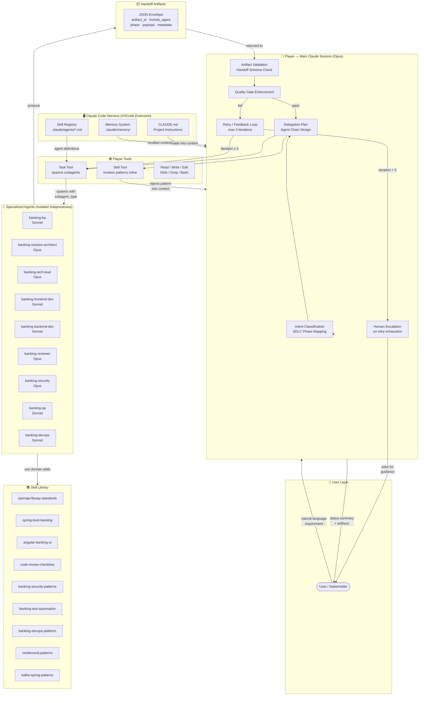
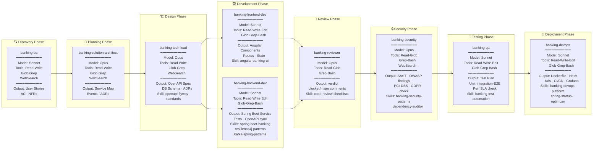
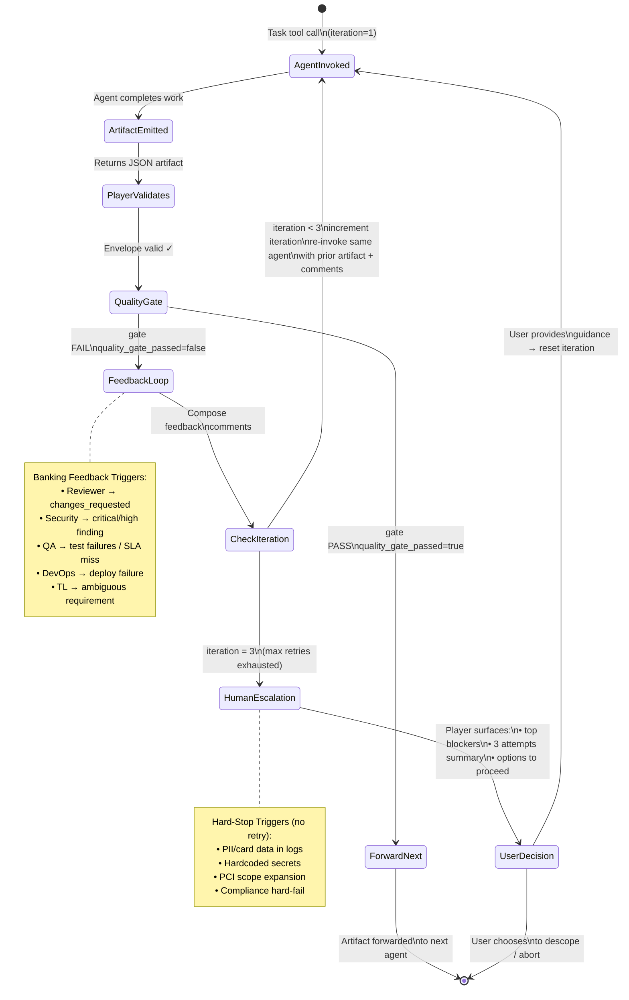
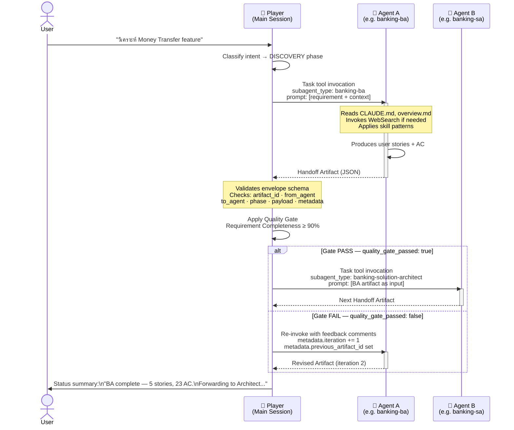
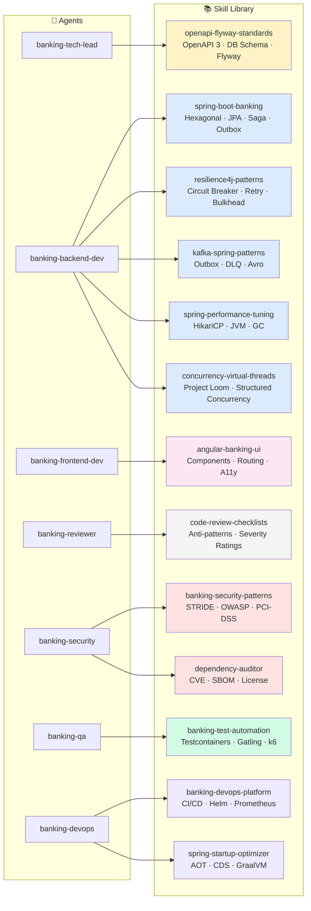
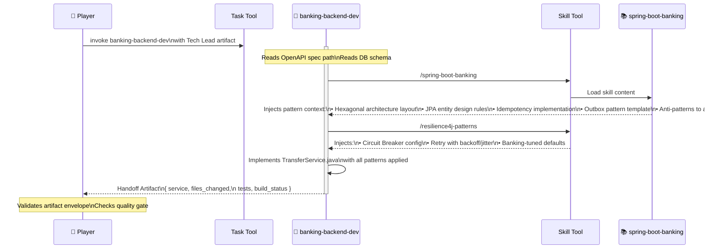
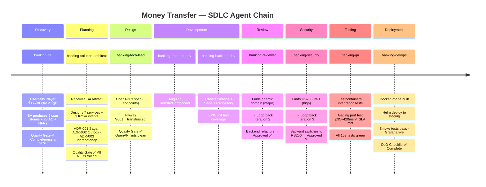

# Agent & Skill Architecture Diagrams

> เอกสารนี้อธิบายภาพรวมการทำงานของ Multi-Agent System ตั้งแต่การรับคำสั่งจากผู้ใช้ การประมวลผลของ Agent แต่ละตัว การเรียกใช้ Skill และการส่งผลลัพธ์กลับ

---

## Diagram 1 — System Overview (Big Picture)

แสดงองค์ประกอบหลักทั้งหมดของระบบและความสัมพันธ์ระหว่างกัน



---

## Diagram 2 — Agent Registry & Metadata

แสดงข้อมูลของ Agent แต่ละตัว — Model, Tools, SDLC Phase, และ Skill ที่ใช้



---

## Diagram 3 — SDLC Forward Flow + Quality Gates

แสดง Workflow หลักพร้อม Quality Gate ที่ Player ตรวจสอบก่อนส่งต่อ Agent ถัดไป

```mermaid
flowchart TD
    START([👤 User Requirement]) --> BA

    BA[banking-ba\nUser Stories · AC · NFRs]
    G1{{"🚦 Gate: Requirement\nCompleteness ≥ 90%\nNo ambiguous terms"}}
    SA[banking-solution-architect\nService Map · Events · ADRs]
    G2{{"🚦 Gate: Architecture\nSoundness\nAll NFRs traced · ≥1 ADR\nper major decision"}}
    TL[banking-tech-lead\nOpenAPI Spec · DB Schema\nFlyway Migrations · ADRs]
    G3{{"🚦 Gate: Contract\nValidated\nOpenAPI lints clean\nThreat model done"}}

    subgraph DEV["Parallel Development"]
        FE[banking-frontend-dev\nAngular UI]
        BE[banking-backend-dev\nSpring Boot Service]
    end

    G4{{"🚦 Gate: Code Health\nCoverage ≥ 80%\nLint passes · Build green"}}
    RV[banking-reviewer\nPrincipal Engineer Review]
    G5{{"🚦 Gate: Best-Practice\nCompliance\nNo blocker/major unresolved"}}
    SEC[banking-security\nOWASP · SAST · PCI-DSS]
    G6{{"🚦 Gate: Vulnerability\nFloor\nNo critical/high CVEs\nNo secrets in code"}}
    QA[banking-qa\nTest Plan · Unit · Integration\nE2E · Performance]
    G7{{"🚦 Gate: Test Coverage\n+ SLA\nAll suites green\nPerf SLA met"}}
    DO[banking-devops\nCI/CD · Docker · Helm\nK8s · Grafana]
    G8{{"🚦 Gate: Deployable\n+ Observable\nSmoke tests pass\nDashboards live"}}
    DONE([✅ DoD Met\nDelivered to User])

    START --> BA --> G1
    G1 -- "pass" --> SA
    G1 -- "fail" --> BA

    SA --> G2
    G2 -- "pass" --> TL
    G2 -- "fail" --> SA

    TL --> G3
    G3 -- "pass" --> DEV
    G3 -- "fail" --> TL

    DEV --> G4
    G4 -- "pass" --> RV
    G4 -- "fail" --> DEV

    RV --> G5
    G5 -- "approved" --> SEC
    G5 -- "changes_requested" --> DEV

    SEC --> G6
    G6 -- "approved" --> QA
    G6 -- "changes_requested" --> DEV

    QA --> G7
    G7 -- "pass" --> DO
    G7 -- "fail" --> DEV

    DO --> G8
    G8 -- "pass" --> DONE
    G8 -- "fail" --> DO

    style DONE fill:#22c55e,color:#fff
    style START fill:#3b82f6,color:#fff
```



---

## Diagram 4 — Feedback Loop & Retry Mechanics

แสดงกลไก Retry ที่ Player จัดการ พร้อม Escalation เมื่อครบ 3 รอบ



---

## Diagram 5 — Handoff Artifact Lifecycle

แสดงวิธีที่ JSON Artifact ถูกสร้าง ตรวจสอบ และส่งต่อระหว่าง Agent



---

## Diagram 6 — Skill Integration Map

แสดงว่า Skill แต่ละตัวถูกใช้งานโดย Agent ใดบ้าง และครอบคลุมความสามารถด้านไหน



---

## Diagram 7 — Agent File Anatomy (agent.md Structure)

แสดงโครงสร้างภายในของไฟล์ agent.md และหน้าที่ของแต่ละส่วน

```mermaid
graph TD
    subgraph FILE["📄 .claude/agents/banking-xxx.md"]
        direction TB

        subgraph FRONT["--- Frontmatter (YAML) ---"]
            F1[name: banking-xxx\nUnique identifier used by Task tool]
            F2[description: ...\nUsed by Player to decide when to invoke]
            F3[tools: Read, Write, Edit, ...\nAllowed tool set — enforced by harness]
            F4[model: sonnet | opus\nSonnet = speed, Opus = reasoning depth]
        end

        subgraph BODY["# Markdown Body"]
            B1[## Persona\nRole, experience, mindset,\nbehavioral constraints]
            B2[## Inputs\nWhat artifact / context\nthis agent expects]
            B3[## Outputs\nHandoff artifact schema\n+ examples]
            B4[## Responsibilities\nDetailed task list]
            B5[## Skills Used\nWhich skill patterns to invoke]
            B6[## Anti-Patterns\nWhat NOT to do]
            B7[## Acceptance Criteria\nSelf-check checklist before emitting]
            B8[## Gotchas\nBanking-specific edge cases]
        end
    end

    subgraph RUNTIME["⚡ At Runtime"]
        R1[Player reads description\nto choose agent]
        R2[Task tool injects frontmatter\nas system config]
        R3[Agent reads body\nas behavioral instructions]
        R4[Harness enforces\ntool allowlist]
        R5[Agent invokes Skill tool\nfor domain patterns]
    end

    FRONT --> RUNTIME
    BODY --> RUNTIME
    F2 --> R1
    F3 --> R4
    F4 --> R2
    B1 --> R3
    B5 --> R5
```

---

## Diagram 8 — Skill Invocation Flow

แสดงวิธีที่ Skill ถูกเรียกใช้และเพิ่ม context ให้กับ Agent



---

## Diagram 9 — Complete End-to-End: Money Transfer Feature

แสดง Timeline การทำงานทั้งหมดสำหรับ Money Transfer feature ตั้งแต่ต้นจนจบ



---

## Summary — Agent × Tool × Skill Matrix

| Agent | Model | Tools | Skills | Emits To |
|---|---|---|---|---|
| `banking-ba` | Sonnet | Read, Write, Glob, Grep, WebSearch | — | `banking-solution-architect` |
| `banking-solution-architect` | Opus | Read, Write, Glob, Grep, WebSearch | — | `banking-tech-lead` |
| `banking-tech-lead` | Opus | Read, Write, Glob, Grep, WebSearch | `openapi-flyway-standards` | `banking-backend-dev` + `banking-frontend-dev` |
| `banking-backend-dev` | Sonnet | Read, Write, Edit, Glob, Grep, Bash | `spring-boot-banking` · `resilience4j-patterns` · `kafka-spring-patterns` · `spring-performance-tuning` · `concurrency-virtual-threads` | `banking-reviewer` |
| `banking-frontend-dev` | Sonnet | Read, Write, Edit, Glob, Grep, Bash | `angular-banking-ui` | `banking-reviewer` |
| `banking-reviewer` | Opus | Read, Glob, Grep, Bash | `code-review-checklists` | `banking-security` (approved) / Dev (changes) |
| `banking-security` | Opus | Read, Glob, Grep, Bash, WebSearch | `banking-security-patterns` · `dependency-auditor` | `banking-qa` (approved) / Dev (findings) |
| `banking-qa` | Sonnet | Read, Write, Edit, Glob, Grep, Bash | `banking-test-automation` | `banking-devops` |
| `banking-devops` | Sonnet | Read, Write, Edit, Glob, Grep, Bash | `banking-devops-platform` · `spring-startup-optimizer` | `banking-player` (done) |

---

## Key Design Principles

### 1. Isolation per Agent
แต่ละ Agent ทำงานใน **isolated subprocess** — ไม่แชร์ context กับ Agent อื่น การสื่อสารเกิดขึ้นผ่าน **Handoff Artifact (JSON)** เท่านั้น

### 2. Player as Single Source of Truth
Player (Main Claude Session) เป็นผู้ **validate ทุก artifact**, **enforce quality gates**, และ **manage retry state** — Agent ไม่รู้ iteration count ของตัวเอง

### 3. Skill = Contextual Pattern Injection
Skill ไม่ใช่ Agent — เป็น **knowledge pattern** ที่ถูก inject เข้าไปใน Agent context ณ runtime ทำให้ Agent ที่ต่างกันสามารถใช้ pattern เดียวกันได้โดยไม่ต้อง duplicate

### 4. Model Selection by Task Type
- **Opus** → agents ที่ต้องการ deep reasoning (Architect, Tech Lead, Reviewer, Security)
- **Sonnet** → agents ที่ต้องการ throughput และ execution (Dev, QA, DevOps, BA)

### 5. Hard Gates = Non-Negotiable
5 Banking Hard Gates ไม่มีทาง bypass แม้จะครบ 3 retry iterations แล้ว — Player ต้อง escalate ไปยัง human ทันที
