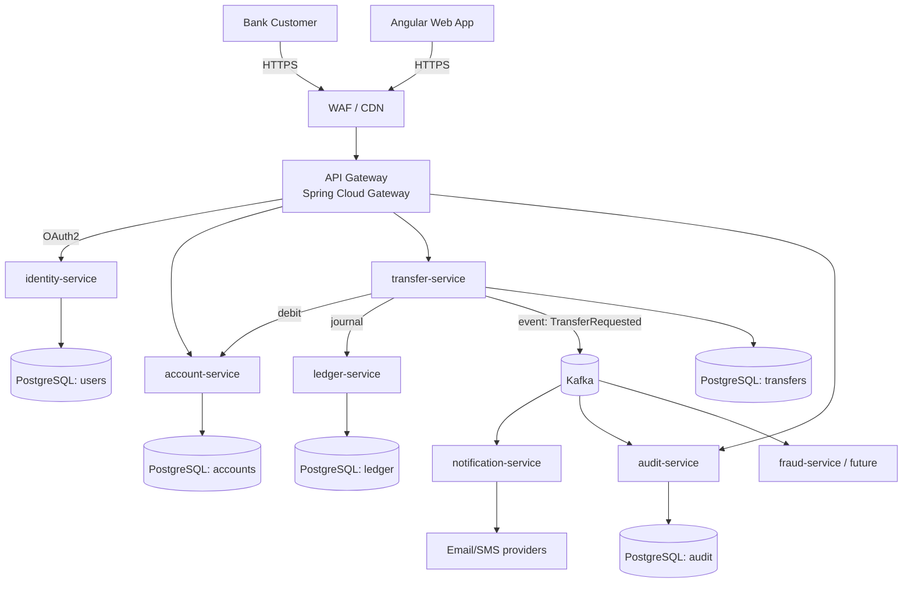

# System Architecture Overview

## High-Level Diagram

## Core Microservices

| Service | Responsibility | Bounded Context |
|---|---|---|
| `api-gateway` | Routing, auth enforcement, rate-limit | Edge |
| `identity-service` | User registration, OAuth2/OIDC, JWT issuance | IAM |
| `account-service` | Account CRUD, balance, holds | Accounts |
| `transfer-service` | Money transfer orchestration (Saga coordinator) | Payments |
| `ledger-service` | Double-entry bookkeeping, immutable journal | Ledger |
| `notification-service` | Email / SMS / push (async via Kafka) | Notifications |
| `audit-service` | Append-only audit log for all financial ops | Compliance |

## Key Architectural Patterns

- **API-first** — OpenAPI 3 specs drive contract; consumers generated from spec
- **Event-driven** — Kafka for async + decoupling; transactional outbox for reliability
- **Saga pattern** — Distributed transactions via choreography or orchestration
- **CQRS (selectively)** — Ledger reads vs writes split for performance
- **Bulkhead** — Each service has own DB; failure isolation
- **Idempotency** — All financial endpoints accept `Idempotency-Key` header

## Cross-Cutting Concerns

| Concern | Tech |
|---|---|
| Logging | Logback + JSON, correlation ID via `traceparent` |
| Metrics | Micrometer → Prometheus |
| Tracing | OpenTelemetry → Jaeger / Tempo |
| Secrets | Vault / AWS Secrets Manager |
| Config | Spring Cloud Config |
| Resilience | Resilience4j (circuit breaker, retry, bulkhead) |
| Discovery | Eureka or Kubernetes Service DNS |
| Auth | OAuth2/OIDC, JWT with short TTL + rotation |

## Deployment Topology

- **Local dev:** Docker Compose (one container per service)
- **Staging / Prod:** Kubernetes (Helm charts), separate namespaces
- **CI/CD:** GitHub Actions → build → test → SAST/SCA → container scan → deploy

## Reference

- Code structure → [project-structure.md](project-structure.md)
- Inter-agent contracts → [handoff-schema.md](handoff-schema.md)
- DoD → [definition-of-done.md](definition-of-done.md)
