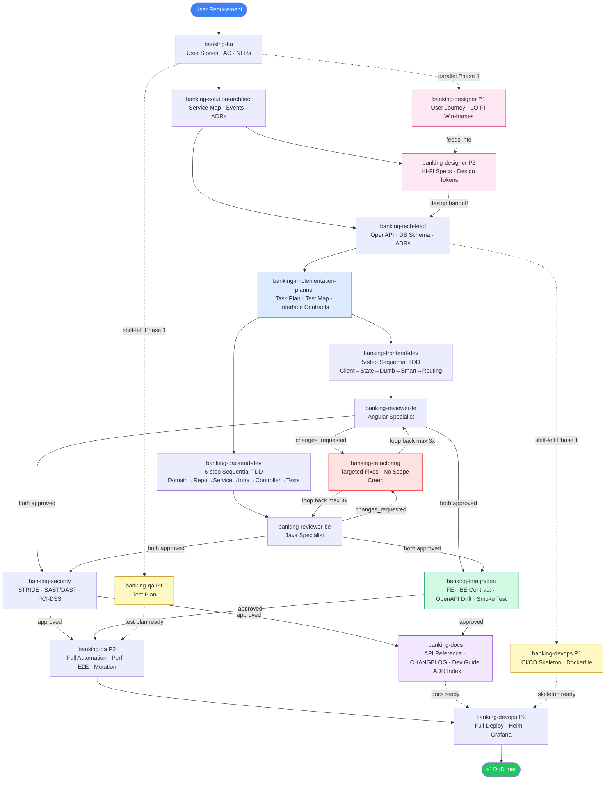

# Workflow & Feedback Loops

## Forward Flow (Optimized — Parallel + Shift-Left + TDD + Integration)

> **เส้นประ (-.->)** = shift-left / parallel track ที่รันพร้อมกับ main flow
> **เส้นทึบ (-->)** = sequential dependency ที่ต้องรอผล
> **สีน้ำเงิน** = Planning phase · **สีแดง** = Refactoring loop · **สีเขียว** = Integration gate · **สีม่วง** = Docs phase

## Feedback Loops

| Trigger | Loop back to | Agent | Action |
|---|---|---|---|
| Reviewer returns `changes_requested` | `banking-refactoring` | `banking-reviewer-be` / `banking-reviewer-fe` | Targeted fixes per findings; loop back to reviewer (max 3 iterations) |
| Integration finds OpenAPI ↔ BE drift | `banking-backend-dev` | `banking-integration` | Fix controller/DTO; re-review not required if isolated fix |
| Integration finds OpenAPI ↔ FE drift | `banking-frontend-dev` | `banking-integration` | Regenerate client or fix type; re-review not required if isolated fix |
| Integration finds contract shape change needed | `banking-tech-lead` | `banking-integration` | API redesign → full loop from TL → Planner → Dev |
| Security finds critical/high vuln | Dev + `banking-solution-architect` if structural | `banking-security` | Patch (or re-architect); re-review required |
| QA finds bug | `banking-backend-dev` or `banking-frontend-dev` | `banking-qa` | Fix + regression test + re-run suite |
| Tech Lead spots ambiguous requirement | `banking-ba` | `banking-tech-lead` | Clarify spec |
| DevOps finds infra constraint | `banking-solution-architect` | `banking-devops` | Re-design |
| Compliance violation | `banking-ba` + `banking-solution-architect` | `banking-security` | Re-scope |

## Retry Policy

- Each loop has **max 3 iterations** (`metadata.iteration` in artifact)
- On 4th attempt → Player **escalates to human** with summary of attempts
- Iteration counter resets when artifact moves forward to a new agent

## Quality Gates

Enforced by Player before each handoff — see [quality-gates.md](quality-gates.md).

## End-to-End Walkthrough: Money Transfer

Reference scenario showing the full chain. Each step's `payload` examples in [handoff-schema.md](handoff-schema.md).

### Scene 1 — Raw Input
> User: *"ผู้ใช้ต้องโอนเงินระหว่างบัญชีได้"*

Player parses → phase: DISCOVERY → invoke `banking-ba`.

### Scene 2 — BA Agent
Output: 5 user stories (happy path, insufficient balance, duplicate, daily limit, audit), AC, NFRs (p95 < 1s, PCI-DSS).
**Quality gate:** completeness ≥ 90%, no ambiguous terms → **pass** → forward.

### Scene 3 — Solution Architect
Output: Service map (7 services), 3 events (`TransferRequested`, `TransferCompleted`, `TransferFailed`), 3 ADRs (Saga orchestration, Outbox pattern, Idempotency-Key strategy).
**Quality gate:** All NFRs traced to design → **pass**.

### Scene 4 — Tech Lead
Output: `transfer.openapi.yaml` (3 endpoints), Flyway `V001__transfers.sql`, ADRs filed.
**Quality gate:** Contract validated against user stories → **pass**.

### Scene 5 — Backend Dev (parallel with Frontend Dev)
Output: `TransferService.java`, `Saga` steps, repository, controller, tests. Coverage 87%.
**Self-check:** lint, build, unit pass → emit artifact.

### Scene 6 — Reviewer
Finds 2 minor issues (missing javadoc), 1 major (anemic domain — balance check in service not entity).
**Verdict:** `changes_requested` → loop back to Backend Dev with comments. (Iteration 2)

### Scene 7 — Backend Dev (iteration 2)
Refactors balance check into `Account` entity. Re-emits artifact.

### Scene 8 — Reviewer (iteration 2)
**Verdict:** `approved` → forward to Security.

### Scene 9 — Security
SAST clean. Finds JWT uses HS256.
**Verdict:** `changes_requested` (high severity) → loop back. (Iteration 3)

### Scene 10 — Backend Dev (iteration 3)
Switches to RS256 with key rotation via Vault. Re-emits.

### Scene 11 — Security (iteration 2)
**Verdict:** `approved` → forward to QA.

### Scene 12 — QA
Adds Testcontainers-based integration tests, Gatling perf test (p95 = 420ms — SLA met).
All green → forward to DevOps.

### Scene 13 — DevOps
Builds image, pushes, deploys to staging via Helm. Smoke tests pass. Grafana dashboard live.
**Returns to Player** with `dod_checklist` complete.

### Scene 14 — Closure
Player verifies DoD checklist → reports to user with deployment URL + dashboards.

## Escalation Examples

- **3 review iterations failed** → Player surfaces top blockers, asks user for architectural guidance
- **Compliance hard-stop** (e.g., PCI scope expansion) → Player pauses workflow, asks user to confirm
- **Conflicting requirements** between BA and Security → Player asks user to arbitrate
