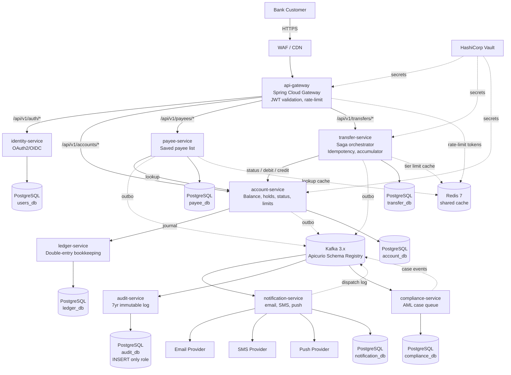

# S3 — Planning (Solution Architect) — Money Transfer

> Summary of [`S3-solution-architect-money-transfer.json`](S3-solution-architect-money-transfer.json). The JSON remains the source of truth for envelope validation; this file makes the payload human-scannable.

## Envelope

| Field | Value |
|---|---|
| Artifact ID | `b5e2d8a4-4f1c-4a7e-9c3b-7d6f1e2a8c34` |
| From | `banking-solution-architect` |
| To | `banking-tech-lead` |
| Phase | `PLANNING` |
| Feature | `money-transfer` |
| Timestamp | `2026-05-18T11:30:00Z` |
| Iteration | 1 |
| Quality Gate | Passed |
| Previous artifact | `a3f7c2e1-84b0-4d9f-b6e3-2c51f0d8a749` |

## TL;DR

Solution Architect decomposed BA's 11 stories into **9 microservices** across 7 bounded contexts (Edge / IAM / Accounts / Payments / Ledger / Compliance / Notifications), wired with **14 Kafka events** under Apicurio Avro schemas, and locked in **12 ADRs** covering saga orchestration, transactional outbox, optimistic locking, AML threshold detection, and the OQ-001 / OQ-005 assumption defaults. Every BA user story and every NFR category is traced to a design decision. **6 risks** identified with mitigations; no shared-DB violations — each service owns its tables.

## Key Deliverables

### Services

| Name | Bounded Context | Responsibility | Owns Data |
|---|---|---|---|
| api-gateway | Edge | JWT validation, rate limit (60/min), TLS termination, correlation_id injection | — |
| identity-service | IAM | OAuth2/OIDC authz server, 15-min access tokens, refresh-token rotation | users, oauth_clients, refresh_tokens, user_consents |
| account-service | Accounts | Account aggregate; balance, holds, status, tier limits; idempotent debit/credit; optimistic locking | accounts, account_holds, customer_tiers, tier_limits, account_status_history |
| payee-service | Payments | Per-customer payee list (add/list/soft-delete/dup-detect); delegates lookup to account-service | payees, payee_lookup_failures |
| transfer-service | Payments | Saga coordinator; idempotency, per-tx + daily limits, AML accumulator, outbox events | transfers, transfer_idempotency, daily_transfer_accumulator, saga_state, transfer_outbox |
| ledger-service | Ledger | Append-only double-entry bookkeeping; source-of-truth for reconciliation | journal_entries, journal_postings, reconciliation_snapshots |
| audit-service | Compliance | Append-only audit log; 7-year retention; INSERT-only DB role | audit_log, audit_log_archive_index |
| notification-service | Notifications | Async fan-out (email/SMS/push); per-channel retry; PDPA opt-out | notification_dispatch_log, channel_preferences |
| compliance-service | Compliance | AML case queue; consumes AmlThresholdBreached; human review workflow | aml_cases, case_assignments, case_review_history |

### Events

| Name | Producer | Consumers | Delivery |
|---|---|---|---|
| TransferRequested | transfer-service | audit-service | at-least-once |
| TransferCompleted | transfer-service | audit-service, notification-service, account-service | at-least-once |
| TransferFailed | transfer-service | audit-service, notification-service | at-least-once |
| TransferCompensated | transfer-service | audit-service, notification-service, account-service | at-least-once |
| AmlThresholdBreached | transfer-service | audit-service, compliance-service | at-least-once |
| AccountDebited | account-service | ledger-service, audit-service | at-least-once |
| AccountCredited | account-service | ledger-service, audit-service | at-least-once |
| AccountStatusChanged | account-service | audit-service, payee-service | at-least-once |
| PayeeAdded | payee-service | audit-service | at-least-once |
| PayeeRemoved | payee-service | audit-service | at-least-once |
| PayeeLookupFailed | payee-service | audit-service | at-least-once |
| NotificationDispatched | notification-service | audit-service | at-least-once |
| NotificationFailed | notification-service | audit-service | at-least-once |
| AmlCaseOpened | compliance-service | audit-service | at-least-once |

### ADRs

| ID | Title | Decision (1-line) | Rejected options |
|---|---|---|---|
| ADR-001 | Saga coordination | Orchestration — transfer-service is the coordinator with persisted saga_state | Choreography; 2PC/XA |
| ADR-002 | Idempotency-Key storage | Per-service `transfer_idempotency` table, SHA-256 key hash, 24h `expires_at` index | Shared Redis SETNX; cache-aside; centralized idempotency-service |
| ADR-003 | Event publishing reliability | Transactional Outbox + in-service relay polling with SKIP LOCKED | Debezium CDC; direct XA publish; after-commit publish |
| ADR-004 | Daily accumulator concurrency | PostgreSQL optimistic lock (`@Version`) in same TX as transfer write | Redis INCR; on-demand SUM; pessimistic SELECT FOR UPDATE |
| ADR-005 | AML threshold detection | Synchronous in-TX check + async outbox event to compliance-service | Kafka Streams windowed agg; nightly batch; synchronous compliance call |
| ADR-006 | Daily limit reset timezone (OQ-001) | Asia/Bangkok civil date (UTC+7); reset at 17:00 UTC = 00:00 Bangkok | UTC midnight; per-customer timezone |
| ADR-007 | AML scope (OQ-005) | Outbound successful transfers per customer per Bangkok civil day | Inbound+outbound combined; per-account only; hard block at threshold |
| ADR-008 | Payee bounded context | Separate payee-service in Payments BC; calls account-service for lookup | Merge into account-service; put into transfer-service |
| ADR-009 | Service mesh | None in v1 — K8s Service DNS + Spring Cloud Gateway + Resilience4j | Istio; Linkerd |
| ADR-010 | Schema registry | Apicurio Registry (Apache 2.0) with Avro | Confluent SR; Protobuf no registry; JSON Schema |
| ADR-011 | Balance concurrency control (US-007) | JPA `@Version` optimistic lock + 3-retry budget; conflict → INSUFFICIENT_FUNDS | SELECT FOR UPDATE; actor-per-account; Redis Redlock |
| ADR-012 | Audit immutability | INSERT-only DB role + append-only trigger + date partitioning | App-only immutability; blockchain audit log |

### NFR Traceability (sample top 10 — see JSON for full 28)

| NFR | Design decision |
|---|---|
| performance_p95_lt_1s_end_to_end | Direct in-DB writes, no extra synchronous hops, Resilience4j time-limiter 800ms on account-service (ADR-001, ADR-002) |
| performance_p99_lt_3s_end_to_end | Resilience4j retry cap 1 with jitter, circuit breaker 50%/10s, HikariCP sized for 500 TPS (ADR-009) |
| performance_internal_p95_lt_300ms | All events emitted via outbox (async); idempotency check is single-row read (ADR-002, ADR-003) |
| performance_payee_lookup_p95_lt_500ms | payee-service Redis cache (60s TTL); account_number indexed in account-service (ADR-008) |
| scalability_sustained_100_burst_500_tps | Stateless services + K8s HPA on CPU + kafka_consumer_lag; Kafka 30 partitions RF=3 by source_account_id (ADR-004) |
| availability_99_95_transfer | Multi-AZ ≥3 replicas; PG Patroni HA; Kafka min.insync.replicas=2; circuit breakers (ADR-009, ADR-011) |
| resilience_rpo_lt_1min | PG synchronous replica; Kafka acks=all; outbox commits in same TX as business write (ADR-003) |
| security_oauth2_jwt_rs256 | identity-service issues RS256 JWTs (15min); gateway validates via JWKS; rotation via Vault |
| compliance_aml_2_000_000_thb | Synchronous threshold check; non-blocking advisory flag; 30s SLA to compliance-service (ADR-005, ADR-007) |
| data_retention_7y_audit_and_transfer | audit_log + transfers date-partitioned; cold-tier after 90d; lifecycle policy (ADR-012) |

All 11 user stories (US-001 to US-011) are individually traced — see `payload.nfr_traceability` keys `us_001_*` through `us_011_*` in the JSON.

### Tech Choices

| Layer | Choice | Version / notes |
|---|---|---|
| Messaging | Apache Kafka | 3.x, ≥3 brokers, RF=3, min.insync.replicas=2 |
| Schema Registry | Apicurio Registry | Apache 2.0; Avro; BACKWARD compatibility on producers (ADR-010) |
| DB | PostgreSQL | 16, one logical DB per service, Patroni HA, pgcrypto |
| DB Migration | Flyway | forward-only, `V<seq>__<desc>.sql` |
| Cache | Redis | 7 — gateway rate-limit, payee lookup (60s TTL), tier limit (60s TTL); not idempotency (ADR-002) |
| API Gateway | Spring Cloud Gateway | Java 21 reactor; JWT validation; rate limiting; correlation_id |
| Service Mesh | None in v1 | K8s NetworkPolicy + Service DNS (ADR-009) |
| Auth | OAuth2 / OIDC | Spring Authorization Server; RS256 JWT 15min TTL; refresh rotation; JWKS |
| Tracing | OpenTelemetry | OTLP → collector → Tempo / Jaeger |
| Metrics | Micrometer → Prometheus | Grafana dashboards |
| Logs | Logback JSON | stdout → Fluent Bit → Loki |
| Resilience | Resilience4j | circuit breaker / retry / time-limiter / bulkhead |
| Secrets | HashiCorp Vault | K8s Vault Agent Injector / CSI |
| Containers | Docker via Buildpacks / jib | base: Eclipse Temurin 21 JRE |
| Orchestration | Kubernetes | EKS/GKE/AKS; Helm per service; namespace per env |
| CI/CD | GitHub Actions | lint → unit → SAST/SCA → build → integration (Testcontainers) → scan → deploy |
| Shared Libraries | common-libs | audit-lib, idempotency-lib, observability-lib |

### Risks

| ID | Title | Severity | Mitigation |
|---|---|---|---|
| RISK-001 | Saga compensation double-fault leaves funds locked | high | Durable saga_state; reconciliation worker scans COMPENSATION_PENDING > 10min; Ops runbook with SLA (needs OQ-006); daily ledger reconciliation |
| RISK-002 | Daily-accumulator hot-row contention at midnight | medium | `INSERT … ON CONFLICT DO UPDATE` on `(account_id, accumulation_date)`; integration-tested with parallel inserts |
| RISK-003 | Kafka consumer lag spike during burst breaches notification SLA | medium | 30 partitions; HPA on kafka_consumer_lag; pre-warm provider connections; per-provider circuit breaker; parallel per-channel dispatch |
| RISK-004 | Idempotency-Key TTL purge lag fills disk (~8.6M rows/day) | low | Hourly chunked DELETE (LIMIT 100k); alert at 30M rows; date-partition table so old partitions can be DROP'd |
| RISK-005 | OQ-001 / OQ-005 assumptions wrong → rework | medium | ADR-006 isolated to one config flag; ADR-007 schema supports account→customer aggregation via view; flag both as go-live blockers |
| RISK-006 | account-service becomes synchronous bottleneck for transfer-service | high | Resilience4j time-limiter 800ms + 50% circuit; bulkhead thread pools; HPA pre-provisioned; combine status+balance into single "reserve-with-check" RPC |

### C4 Context Diagram

## Quality Gate Check (Player validation)

- [x] All 11 BA user stories mapped to one or more services + ADRs
- [x] All 7 NFR categories traced to design decisions
- [x] No shared-DB violations — each service owns its tables (`owns_data` disjoint)
- [x] All Kafka events have producer, consumer list, schema_ref, delivery semantics
- [x] All 12 ADRs include rationale + rejected options (≥2 each)
- [x] OQ-001 and OQ-005 carried forward as ADR-006 / ADR-007 assumptions with SME-confirmation flag
- [x] C4 Context diagram inlined as Mermaid (Tech Lead can consume directly)
- [x] Risks (6) include severity + mitigation for each

## Open Items

- **ADR-006 (timezone)** and **ADR-007 (AML scope)** are reasonable defaults pending Compliance SME confirmation; both flagged as go-live blockers (RISK-005). Backend dev for US-001 / US-002 / US-003 can proceed in parallel as they do not touch these code paths.
- **OQ-006 (manual COMPENSATION_FAILED SLA)** still open — needed for Ops runbook authoring (RISK-001).
- **account-service "reserve-with-check" RPC** noted as a Tech-Lead design item to halve round trips on the critical path (RISK-006 mitigation).

## Links

- **Source JSON:** [S3-solution-architect-money-transfer.json](S3-solution-architect-money-transfer.json)
- **Previous artifact:** [S2-ba-money-transfer.md](S2-ba-money-transfer.md)
- **Next artifact:** [S4-tech-lead-money-transfer.md](S4-tech-lead-money-transfer.md) (Pending)
- **Communications timeline:** [../agents-comms/timeline.md](../agents-comms/timeline.md)
