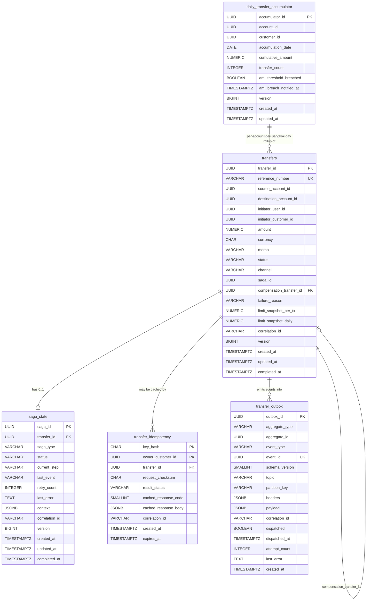

# S4 — Tech Lead Design — Money Transfer

> Summary of [`S4-tech-lead-money-transfer.json`](S4-tech-lead-money-transfer.json). The JSON remains the source of truth for envelope validation; this file makes the payload human-scannable.

## Envelope

| Field | Value |
|---|---|
| Artifact ID | `c8d4e9f6-3a72-4b1d-8e5c-1f9d2a6b7c83` |
| From | `banking-tech-lead` |
| To | `banking-backend-dev` |
| Phase | `DESIGN` |
| Feature | `money-transfer` |
| Timestamp | `2026-05-18T13:30:00Z` |
| Iteration | 1 |
| Quality Gate | Passed |
| Previous artifact | `b5e2d8a4-4f1c-4a7e-9c3b-7d6f1e2a8c34` (Solution Architect) |

## TL;DR

Tech Lead handoff for Money Transfer v1 (intra-bank, THB). Delivers a fully-specified OpenAPI 3.0.3 contract (POST + GET implemented; payees lookup + transfer history stubbed), 5 reversible Flyway migrations covering all 11 stories' data needs, 3 Avro event schemas for the outbox, and 4 ADRs (013-016) pinning the error taxonomy, outbox cadence, STRIDE threat model, and on-the-wire money serialization. Backend dev scope for this iteration: US-001 happy path + US-003 idempotency.

## Key Deliverables

### OpenAPI Spec

- **Path:** [`backend/transfer-service/api/openapi.yaml`](../../backend/transfer-service/api/openapi.yaml) (file persisted separately from this envelope)
- **Spec version:** OpenAPI 3.0.3, API version 1.0.0
- **Approx. size:** ~16 KB of YAML (full content embedded in the source JSON under `payload.openapi_spec_content`)
- **Auth:** `bearerAuth` — OAuth2 / OIDC RS256 JWT (15-minute TTL)
- **Error model:** RFC 7807 Problem Details (`application/problem+json`) with machine-readable `code` + W3C `traceId`

#### Endpoints

| # | Method | Path | Status | Notable parameters / headers |
|---|---|---|---|---|
| 1 | POST | `/api/v1/transfers` | Implemented (US-001 + US-003) | `Idempotency-Key` (UUID v4, required), `X-Request-Id`, `bearerAuth`; responses 200/400/401/403/409/422/429/500/503 |
| 2 | GET | `/api/v1/transfers/{transferId}` | Implemented (status polling) | `transferId` path UUID, `X-Request-Id`; responses 200/401/403/404/500 |
| 3 | GET | `/api/v1/payees/lookup` | Planned stub (`x-status: planned`, US-010) | `accountNumber` query (10-digit); returns 501 |
| 4 | GET | `/api/v1/transfers/history` | Planned stub (`x-status: planned`, US-001-history) | `page`, `size`, `sort`; returns 501 |

### Error Code Taxonomy

19 codes frozen in `components.schemas.ProblemDetail.code`. Adding a new code requires a new ADR.

**Client / request errors**

| Code | Typical HTTP | Source |
|---|---|---|
| `VALIDATION_ERROR` | 400 | Generic schema/validation failure |
| `MEMO_TOO_LONG` | 400 | Memo > 200 chars |
| `UNAUTHORIZED` | 401 | Bearer missing / invalid / expired |
| `FORBIDDEN` | 403 | Authenticated but lacks scope or ownership |
| `TRANSFER_NOT_FOUND` | 404 | GET by unknown transferId |
| `IDEMPOTENCY_KEY_CONFLICT` | 409 | Same key, different payload (US-003 AC4) |
| `RATE_LIMITED` | 429 | Gateway 60 req/min/customer breached |

**Business rule violations (422)**

| Code | Reason |
|---|---|
| `INSUFFICIENT_FUNDS` | Source balance < amount (US-002) |
| `TRANSACTION_LIMIT_EXCEEDED` | Per-tx limit hit |
| `DAILY_LIMIT_EXCEEDED` | Cumulative daily limit hit (US-005) |
| `SOURCE_ACCOUNT_FROZEN` | Source frozen |
| `SOURCE_ACCOUNT_INACTIVE` | Source inactive |
| `ACCOUNT_FROZEN` | Destination frozen |
| `ACCOUNT_INACTIVE` | Destination inactive |
| `PAYEE_NOT_FOUND` | Destination account unknown |
| `CONCURRENT_CONFLICT` | Optimistic-lock contention |
| `COMPENSATION_TRIGGERED` | Saga rolled back after partial commit |

**System / dependency (5xx)**

| Code | Typical HTTP | Reason |
|---|---|---|
| `DEPENDENCY_UNAVAILABLE` | 503 | Resilience4j circuit open / time-limiter |
| `INTERNAL_ERROR` | 500 | Unexpected; trace only in OTel |

### DB Migration Files (Flyway, reversible)

All migrations live under `backend/transfer-service/src/main/resources/db/migration/`. Each carries an explicit runbook-only `DROP TABLE` for the down path.

| File | Table created | Key columns | Reversible | Comment / purpose |
|---|---|---|---|---|
| `V001__create_transfers.sql` | `transfers` | `transfer_id` (PK, UUID), `reference_number` (UQ), `amount NUMERIC(19,4)`, `currency CHAR(3)`, `status`, `saga_id`, `compensation_transfer_id` (FK self), `version BIGINT`, `correlation_id` | Yes | Aggregate root for the Saga state machine; 3 indexes (customer history, source-account ops, partial saga-recovery) |
| `V002__create_transfer_idempotency.sql` | `transfer_idempotency` | `key_hash CHAR(64)` + `owner_customer_id` (composite PK), `request_checksum CHAR(64)`, `cached_response_body JSONB`, `expires_at` | Yes | Per-service idempotency store (ADR-013); 24h TTL; index on `expires_at` for purge job |
| `V003__create_saga_state.sql` | `saga_state` | `saga_id` (PK), `transfer_id` (UQ FK), `status`, `current_step`, `context JSONB`, `retry_count`, `version` | Yes | Persistent saga coordinator state for pod-restart recovery (ADR-001 / US-008) |
| `V004__create_outbox.sql` | `transfer_outbox` | `outbox_id` (PK), `event_id` (UQ), `event_type`, `topic`, `partition_key`, `payload JSONB`, `dispatched BOOLEAN`, `attempt_count` | Yes | Transactional outbox per ADR-003; partial index on `dispatched=false` for the SKIP-LOCKED poll |
| `V005__create_daily_transfer_accumulator.sql` | `daily_transfer_accumulator` | `accumulator_id` (PK), `(account_id, accumulation_date)` UQ, `cumulative_amount NUMERIC(19,4)`, `transfer_count`, `aml_threshold_breached`, `version` | Yes | Daily limit (US-005) + AML threshold (US-009); `accumulation_date` is Bangkok civil date (ADR-006) |

### Event Schemas (Avro)

All under namespace `com.bank.payments.transfer.v1`; topics follow `<service>.<entity>.<event>.v<n>`.

| Schema file | Topic | Key fields |
|---|---|---|
| `TransferRequested.avsc` | `transfer.transfer.requested.v1` | `eventId`, `transferId`, `referenceNumber`, `sourceAccountId`, `destinationAccountId`, `initiatorCustomerId`, `amount` (decimal 19,4), `currency`, `channel` enum, `idempotencyKeyHash` (SHA-256, never raw key) |
| `TransferCompleted.avsc` | `transfer.transfer.completed.v1` | `transferId`, `referenceNumber`, `amount`, `debitJournalEntryId?`, `creditJournalEntryId?`, `completedAt` |
| `TransferFailed.avsc` | `transfer.transfer.failed.v1` | `transferId`, `failureReason` enum (14 symbols), `failureStage` enum (`VALIDATION` / `PRECHECK` / `DEBIT` / `CREDIT` / `COMPENSATION`), `compensationTransferId?`, `failedAt` |

### ADRs

| ID | Title | Decision (one line) |
|---|---|---|
| ADR-013 | Error code taxonomy + Idempotency-Key hashing strategy | SHA-256 hash of raw key, composite PK `(key_hash, owner_customer_id)`, payload checksum via canonical JSON; 19-code error enum frozen |
| ADR-014 | Outbox relay poll cadence and dispatch semantics | `@Scheduled(fixedDelay=500)`, batch=100, `FOR UPDATE SKIP LOCKED`, `acks=all`, hourly 7-day purge, consumer dedupe by `event_id` |
| ADR-015 | STRIDE threat model for POST + GET transfers | Threat model passed using existing mitigations; backend dev must add JWT-subject vs `sourceAccountId` ownership check (cached 60s in Redis) |
| ADR-016 | Money serialization on the wire: decimal string, not JSON number | `amount` is a JSON string matching `^[0-9]+(\.[0-9]{1,4})?$`; server parses with `BigDecimal.setScale(4, UNNECESSARY)` |

### Implementation Notes for Backend Dev

1. **Idempotency** — wrap POST `/transfers` in a `@Transactional` use-case. First DB action: SELECT on `transfer_idempotency` by `(key_hash, owner_customer_id)`. Hit-equal-checksum returns cached body; hit-different-checksum returns 409 without executing business logic; miss INSERTs a `PENDING` placeholder in the same transaction as the `transfers` INSERT, then UPDATEs to `COMPLETED`/`FAILED`/`REJECTED` with the final body. Use `common-libs/idempotency-lib` for canonical JSON (ADR-013).
2. **Outbox publishing** — never call `kafkaTemplate.send()` from the use-case. INSERT into `transfer_outbox` in the same `@Transactional` method as the business write. A separate `@Scheduled(fixedDelay=500)` bean on a dedicated single-thread executor polls `WHERE dispatched=false ORDER BY created_at LIMIT 100 FOR UPDATE SKIP LOCKED` and dispatches with `acks=all`. Consumer dedupe is on `event_id` (ADR-014). Poller must not block the user-facing thread pool.
3. **Saga coordination** — `TransferSagaCoordinator` is a stateful `@Component` driving `STARTED -> LIMIT_CHECK_DONE -> DEBITED -> CREDITED -> COMPLETED`. Each transition persists `saga_state.current_step` + `version` (optimistic lock) BEFORE the next downstream call. Recovery worker scans `status IN ('IN_PROGRESS','COMPENSATING') AND updated_at < now() - interval '30 seconds'` and resumes by replaying the current step. Steps MUST be idempotent (keyed by `(transfer_id, step_name)`).
4. **Optimistic locking on `daily_transfer_accumulator`** — design the entity now with `@Version` (used by US-005). On `OptimisticLockException` retry the SELECT+UPDATE once; if still conflicting return 503 `DEPENDENCY_UNAVAILABLE` with `Retry-After: 1`. Use `INSERT ... ON CONFLICT (account_id, accumulation_date) DO UPDATE` for first-of-day to avoid the midnight race (RISK-002).
5. **Resilience4j on account-service calls** — time-limiter `timeoutDuration=800ms`, circuit breaker `slidingWindowSize=20 / failureRateThreshold=50 / waitDurationInOpenState=10s / permittedNumberOfCallsInHalfOpenState=5`, bulkhead `maxConcurrentCalls=50 / maxWaitDuration=100ms`. Annotate each client method with `@TimeLimiter`, `@CircuitBreaker`, `@Bulkhead`. Map `TimeoutException` / `CallNotPermittedException` to `DependencyUnavailableException` -> 503 + `Retry-After: 2`.
6. **Transactional boundaries** — `@Transactional` belongs on the `@Service` use-case (`TransferUseCase.execute`), never on the `@RestController`. Exception-to-Problem-Detail mapping in the controller advice runs OUTSIDE the transaction. Default `propagation=REQUIRED`, `isolation=READ_COMMITTED`.
7. **Reference number generation** — `TRF-YYYYMMDD-XXXXXXXX` where the suffix is uppercase Crockford-base32 of a per-day monotonic value pulled from a PostgreSQL `reference_number_seq` sequence (follow-up migration). Server-side only — never accepted from the client. Uniqueness enforced by `uq_transfers_reference_number`; on the (~zero-probability) collision, regenerate and retry once.
8. **Logging + masking** — every log line uses the observability-lib JSON layout with `correlation_id`, `trace_id`, `transfer_id`, and `source_account_id` masked to last 4 digits via Logback `MaskingConverter`. Never `log.info(amount)` — always `log.info("transfer amount: {}", maskedAmount)`. Full amount lives in the encrypted `audit_log` table only (compliance_pdpa).
9. **JWT subject ownership check** — before any precheck, call account-service `GET /api/v1/accounts/by-customer/{customerId}` (cached 60s in Redis, customer-scoped key) and verify `sourceAccountId` is in that list. Return 403 `FORBIDDEN` if not. Mitigates the spoofing threat from ADR-015.

### Frontend Notes (for future Angular work)

1. Generate `Idempotency-Key` as a UUID v4 when the user OPENS the form (not on submit); cache in component state until a terminal response (200/400/401/403/409/422). On 503 + `Retry-After`, retry with the SAME key; only mint a new key after terminal response or navigation.
2. Treat `amount` as an opaque string end-to-end. Use `decimal.js` (or BigInt with fixed scale) for any arithmetic. Generated TS client types `amount` as `string` — do not narrow (ADR-016).
3. On HTTP 409 `IDEMPOTENCY_KEY_CONFLICT`, do NOT retry — show an explanatory dialog and force re-open of the form (which generates a new key).
4. On 503 with `Retry-After`, show a "Confirming your transfer..." banner and auto-retry up to 3 times (delays from `Retry-After`, default 2s). On 4th failure show "Service is unavailable — your money has not been moved..." with `X-Request-Id` in the support link.
5. Use `idempotencyStatus` to choose messaging: `FIRST_WRITE` -> success toast; `IDEMPOTENT_REPLAY` -> silently update UI (no duplicate toast).
6. After any 5xx or socket timeout, poll `GET /api/v1/transfers/{transferId}` every 1s for up to 10s to learn whether the original request committed. Sequence: cache the key, retry POST (returns cached response with `transferId`), then poll if still unknown.

### ERD

## Quality Gate Check

- [x] OpenAPI contract complete for in-scope endpoints (POST + GET) with full RFC 7807 error model
- [x] All 19 error codes enumerated in the `ProblemDetail.code` schema and aligned with ADR-013
- [x] DB schema covers all 11 stories' data needs in 5 reversible Flyway migrations
- [x] Avro schemas published for the 3 in-scope outbox events (Requested / Completed / Failed)
- [x] Threat model (ADR-015) walked through STRIDE — no new mitigations required beyond architect's design
- [x] All ADRs build on top of architect decisions; no deviations
- [x] Implementation notes covering idempotency, outbox, saga, resilience, transactional boundaries, ref-number, logging, JWT ownership

## Open Items

- Other services' schemas (account-service, payee-service, audit-service, notification-service) deferred to per-service tech-lead sessions.
- US-002, US-004..US-011 endpoints not yet contracted — only US-001 happy path + US-003 idempotency in this iteration.
- `reference_number_seq` SQL sequence noted as a follow-up migration (not in V001-V005).
- Stub endpoints (`/payees/lookup`, `/transfers/history`) marked `x-status: planned`; full contracts arrive with US-010 and US-001-history.

## Links

- **Source JSON:** [S4-tech-lead-money-transfer.json](S4-tech-lead-money-transfer.json)
- **OpenAPI YAML (separate file):** [`backend/transfer-service/api/openapi.yaml`](../../backend/transfer-service/api/openapi.yaml)
- **Previous artifact:** [S3-solution-architect-money-transfer.md](S3-solution-architect-money-transfer.md)
- **Next artifact:** [S5-backend-dev-money-transfer.md](S5-backend-dev-money-transfer.md)
- **Communications timeline:** [../agents-comms/timeline.md](../agents-comms/timeline.md)
