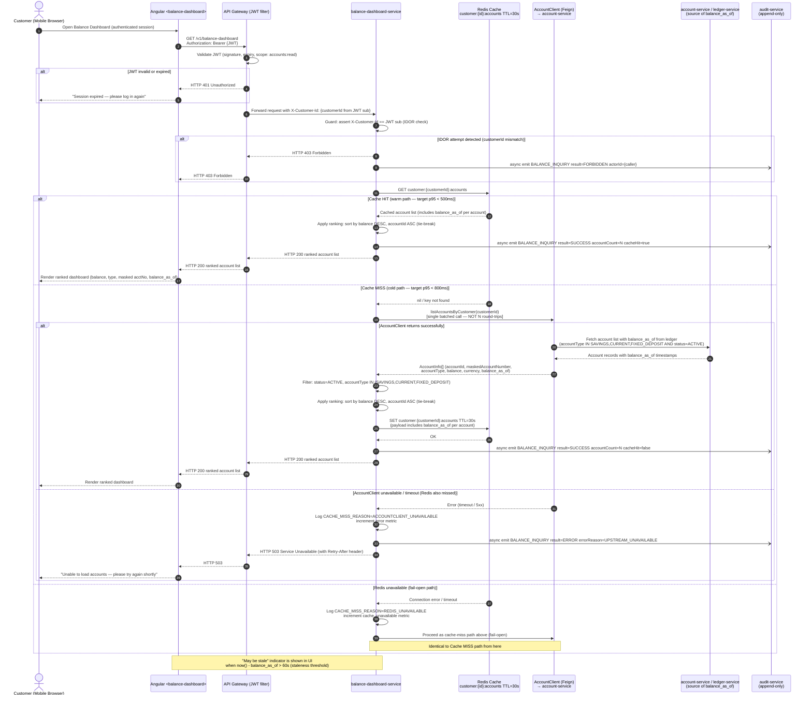

# Process Flow — Account Balance Comparison Dashboard

> **Feature slug:** `balance-comparison`
> **Artifact:** BA-001 (initial)
> **Sprint:** SPRINT-2026-Q2-BC-01
> **Diagram format:** Mermaid sequence diagram

---

## Overview

The flow covers two main paths:

1. **Cache hit path** — Redis has a fresh entry for the customer; audit is still emitted; response returned quickly (target p95 < 500ms).
2. **Cache miss path** — Redis has no entry (cold start or TTL expired); `AccountClient` is called with a single batched request; result is cached; audit is emitted; response returned (target p95 < 800ms).

The audit-emit path is shown as a parallel async fork — it is never skipped regardless of cache state.

---

## Sequence Diagram



---

## Alt Paths Summary

| Alt Path | Trigger | Outcome |
|---|---|---|
| JWT invalid / expired | Gateway JWT validation failure | HTTP 401; no data returned; no audit event (request rejected before BDS) |
| IDOR attempt | `customerId` in request != JWT `sub` | HTTP 403; audit event emitted with `result=FORBIDDEN`; no data returned |
| Cache HIT (warm) | Redis has fresh entry within TTL | Data served from cache; audit emitted (cache does NOT suppress audit); p95 < 500ms target |
| Cache MISS (cold) | Redis key absent or expired | Single batched `AccountClient` call; result cached; audit emitted; p95 < 800ms target |
| Redis unavailable | Redis connection failure | Fail-open: proceed as cache-miss; observability counter incremented |
| AccountClient unavailable | Upstream timeout / 5xx after retries | HTTP 503 returned; audit emitted with `result=ERROR`; customer shown retry message |
| Customer has zero in-scope accounts | Filter returns empty list | HTTP 200 with empty `accounts` array; audit emitted with `accountCount=0` |
| Staleness threshold exceeded | `balance_as_of` is older than 60 seconds | Response still returned; UI shows "may be stale" indicator on affected rows |

---

## Audit-Emit Path (always fires)

```
BDS -)  Audit : async emit (fire-and-forget, non-blocking)
        eventType    = BALANCE_INQUIRY
        actorId      = customerId (from JWT sub)
        purpose      = balance-inquiry
        channel      = MOBILE_BANKING
        correlationId = (traceparent from OTel)
        timestamp    = UTC now
        result       = SUCCESS | FORBIDDEN | ERROR
        accountCount = N (count of accounts returned; 0 on empty; absent on FORBIDDEN/ERROR)
        cacheHit     = true | false (not applicable on FORBIDDEN)
```

The audit emit is decoupled from the response path using fire-and-forget async invocation (same pattern as money-transfer audit-service events). Response to customer is not held waiting for audit confirmation.

---

## Notes for SA (Architecture Decisions)

1. **Service boundary:** Where does the ranking + caching logic live — new `balance-dashboard-service` or extension of `account-service`? SA owns this ADR. The flow above is drawn as `balance-dashboard-service` (separate) as the default, but the sequence steps are valid either way.
2. **`AccountClient` batch API:** The flow assumes a single `listAccountsByCustomer(customerId)` call that returns all accounts in one response. If `AccountClient` currently supports only individual account lookups, TL must add or expose the batch endpoint. This is flagged as SUBDEC-002 (no default provided — SA/TL decision required).
3. **Audit event schema:** The flow reuses the existing `audit-service` event emitter from money-transfer. SA/TL to confirm whether the existing event schema accommodates `purpose = balance-inquiry` and `cacheHit` fields, or whether a new event type is needed (see DEP-003 in risk-register.md).
