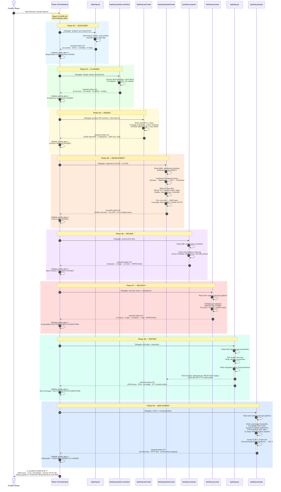

# Agent Communication Sequence — Money Transfer v1

Mermaid sequence diagram showing every inter-agent handoff for the Money Transfer SDLC run.
Render this in any Mermaid-compatible viewer (GitHub, VS Code extension, mermaid.live).

---

## Summary Statistics

| Metric | Value |
|---|---|
| Total handoffs | 8 |
| Feedback loops triggered | 0 (all gates passed on iteration 1) |
| Quality gate results | 6 × ✅ pass + 2 × ⚠️ pass-with-conditions |
| Bugs filed by QA back to Dev | 2 (BUG-QA-001, BUG-QA-002) |
| Schema fixes applied by DevOps | 7 (Flyway V001/V002/V004) |

## How to Render

**GitHub / GitLab:** This file renders automatically in the browser.

**VS Code:** Install the *Markdown Preview Mermaid Support* extension, then open preview (`Cmd+Shift+V`).

**Online:** Paste the diagram block at [mermaid.live](https://mermaid.live).
