```mermaid
flowchart TB
    classDef player      fill:#1e3a8a,color:#fff,stroke:#1e3a8a,font-weight:bold
    classDef discovery   fill:#3b82f6,color:#fff,stroke:#1d4ed8
    classDef design      fill:#db2777,color:#fff,stroke:#be185d
    classDef dev         fill:#059669,color:#fff,stroke:#047857
    classDef review      fill:#7c3aed,color:#fff,stroke:#6d28d9
    classDef security    fill:#dc2626,color:#fff,stroke:#b91c1c
    classDef qa          fill:#d97706,color:#fff,stroke:#b45309
    classDef devops      fill:#0891b2,color:#fff,stroke:#0e7490
    classDef shiftleft   fill:#fef9c3,color:#78350f,stroke:#d97706,stroke-dasharray:6 3
    classDef gate        fill:#f0fdf4,color:#166534,stroke:#16a34a,font-size:12px
    classDef artifact    fill:#f8fafc,color:#475569,stroke:#cbd5e1,font-size:11px
    classDef skill       fill:#fefce8,color:#713f12,stroke:#ca8a04
    classDef done        fill:#16a34a,color:#fff,stroke:#15803d,font-weight:bold

    USER([👤 User Requirement])

    %% ─────────────────────────────────────────────────────────
    %% PLAYER / ORCHESTRATOR
    %% ─────────────────────────────────────────────────────────
    subgraph ORCHESTRATOR["🎯  PLAYER / ORCHESTRATOR  ·  banking-player  ·  model: Opus"]
        direction TB

        subgraph PM["📋 Planning Mode — ITPM (triggered after BA)"]
            direction LR
            PM1["① WBS\nWork Breakdown Structure"]
            PM2["② Effort Estimate\nstory points / days per agent"]
            PM3["③ Release Roadmap\nphase milestones + parallel tracks"]
            PM4["④ Risk Register\ntop risks + mitigation"]
        end

        %% ── DISCOVERY ──────────────────────────────────────
        BA["🔍  BA Agent  ·  banking-ba  ·  Sonnet
        ─────────────────────────────────────
        PLAN: actors · story list · AC map · banking constraints
        ─────────────────────────────────────
        A1 → User Stories · Acceptance Criteria
             Process Flows · NFRs · Compliance"]
        class BA discovery

        A1(["A1  BA Artifact"])
        class A1 artifact

        %% ── PARALLEL BAND 1 ────────────────────────────────
        subgraph P1["── PARALLEL ① ─────────────────────────────────────────────────────────────"]
            direction LR

            SA["🏗️  Solution Architect  ·  banking-solution-architect  ·  Opus
            ─────────────────────────────────────
            PLAN: domain map · service list · events · ADRs · NFR trace
            ─────────────────────────────────────
            A2 → Service Map · Kafka Events
                 ADRs · NFR Traceability"]
            class SA discovery

            DS1["🎨  Designer Phase 1  ·  banking-designer  ·  Opus
            ─────────────────────────────────────
            PLAN: screen list · AC map · component plan · UX risks
            ─────────────────────────────────────
            A2b → User Journey Maps
                  LO-FI Wireframes"]
            class DS1 design

            QAP1["🧪  QA Phase 1  ·  banking-qa  ·  Sonnet
            ─────────────────────────────────────
            PLAN: AC→test map · banking cases · pyramid plan
            ─────────────────────────────────────
            Test Plan only — no code execution
            ✦ SHIFT-LEFT ✦"]
            class QAP1 shiftleft
        end

        A2(["A2  SA Artifact"])
        class A2 artifact
        A2b(["A2b  LO-FI Wireframes"])
        class A2b artifact

        DS2["🎨  Designer Phase 2  ·  banking-designer  ·  Opus
        ─────────────────────────────────────
        PLAN: screen list · AC map · component plan · UX risks
        ─────────────────────────────────────
        A3b → HI-FI Component Specs · Design Tokens
              Interaction Specs · A11y Checklist · Handoff Notes"]
        class DS2 design

        A3b(["A3b  HI-FI Design Spec"])
        class A3b artifact

        %% ── DESIGN ─────────────────────────────────────────
        TL["⚙️  Tech Lead  ·  banking-tech-lead  ·  Opus
        ─────────────────────────────────────
        PLAN: endpoint list · DB tables · Flyway migrations · AC map
        ─────────────────────────────────────
        A3 → OpenAPI 3 Spec · DB Schema
             Flyway Migrations · ADRs · Impl Notes"]
        class TL discovery

        A3(["A3  TL Artifact"])
        class A3 artifact

        %% ── PARALLEL BAND 2 ────────────────────────────────
        subgraph P2["── PARALLEL ② ─────────────────────────────────────────────────────────────"]
            direction LR

            FE["🖥️  Frontend Dev  ·  banking-frontend-dev  ·  Sonnet
            ─────────────────────────────────────
            PLAN: component list · route plan · AC map · design spec check
            ─────────────────────────────────────
            A4a → Angular Components · Routes
                  State Management · API Integration"]
            class FE dev

            BE["☕  Backend Dev  ·  banking-backend-dev  ·  Sonnet
            ─────────────────────────────────────
            PLAN: class list · AC map · Saga steps · test cases · Outbox
            ─────────────────────────────────────
            A4b → Spring Boot Service · Saga
                  Outbox · Repository · Unit Tests"]
            class BE dev

            DOP1["🚀  DevOps Phase 1  ·  banking-devops  ·  Sonnet
            ─────────────────────────────────────
            PLAN: pipeline stages · K8s resources · rollback strategy
            ─────────────────────────────────────
            Dockerfile · CI/CD Pipeline Skeleton
            Helm Chart Scaffold ✦ SHIFT-LEFT ✦"]
            class DOP1 shiftleft
        end

        A4a(["A4a  FE Artifact"])
        A4b(["A4b  BE Artifact"])
        class A4a artifact
        class A4b artifact

        %% ── PARALLEL BAND 3 (REVIEW) ───────────────────────
        subgraph P3["── PARALLEL ③ ─────────────────────────────────────────────────────────────"]
            direction LR

            RVFE["🔎  Frontend Reviewer  ·  banking-reviewer-fe  ·  Opus
            ─────────────────────────────────────
            PLAN: file list · Angular checklist · risk order (XSS→logic→style)
            ─────────────────────────────────────
            Angular · XSS · Subscribe Leaks
            WCAG A11y · UX · Console.log PII"]
            class RVFE review

            RVBE["🔎  Backend Reviewer  ·  banking-reviewer-be  ·  Opus
            ─────────────────────────────────────
            PLAN: file list · Spring checklist · domain→Saga→service→infra
            ─────────────────────────────────────
            Java · Saga Compensation · Outbox
            Idempotency · JPA · Anemic Domain"]
            class RVBE review
        end

        G_RV{{"🚦 Gate: BOTH reviewers approved?\n→ fail: loop back only failing side (max 3×)"}}
        class G_RV gate

        %% ── SECURITY ────────────────────────────────────────
        SEC["🔒  Security Agent  ·  banking-security  ·  Opus
        ─────────────────────────────────────
        PLAN: STRIDE threat model · OWASP map · scan sequence
        ─────────────────────────────────────
        A5 → OWASP Top 10 · SAST/SCA · STRIDE
             PCI-DSS · GDPR · PDPA · Secrets Scan"]
        class SEC security

        A5(["A5  Security Artifact"])
        class A5 artifact

        G_SEC{{"🚦 Gate: No critical/high CVE · Secrets clean?\n→ fail: loop back to dev (max 3×)"}}
        class G_SEC gate

        %% ── QA PHASE 2 ──────────────────────────────────────
        QA["🧪  QA Phase 2  ·  banking-qa  ·  Sonnet
        ─────────────────────────────────────
        PLAN: AC→test coverage matrix · banking-specific cases
        ─────────────────────────────────────
        A6 → Unit · Integration · Contract
             E2E · Performance (Gatling/k6) · Mutation (PIT)
        + uses test plan from QA Phase 1"]
        class QA qa

        A6(["A6  QA Artifact"])
        class A6 artifact

        G_QA{{"🚦 Gate: All suites green · SLA met · Coverage ≥ 80%?\n→ fail: loop back to dev (max 3×)"}}
        class G_QA gate

        %% ── DEVOPS PHASE 2 ──────────────────────────────────
        DO["🚀  DevOps Phase 2  ·  banking-devops  ·  Sonnet
        ─────────────────────────────────────
        PLAN: pipeline stages · K8s resources · observability · rollback
        ─────────────────────────────────────
        A7 → Docker Build + Scan · Helm Deploy
             K8s Manifests · Grafana Dashboard
             Smoke Tests · Rollback Verified
        + uses CI/CD skeleton from DevOps Phase 1"]
        class DO devops

        DONE(["✅  DoD Met  ·  Deployed to Staging\nSmoke Tests Pass · Dashboards Live · Rollback Tested"])
        class DONE done
    end

    %% ─────────────────────────────────────────────────────────
    %% SKILL LIBRARY (right column)
    %% ─────────────────────────────────────────────────────────
    subgraph SKILLBOX["📚  SKILL LIBRARY — invoked by agents at runtime"]
        direction TB

        SK_TL["📄  openapi-flyway-standards
        OpenAPI 3 conventions · DB schema design
        Flyway migration authoring
        ▸ Tech Lead"]
        class SK_TL skill

        SK_SB["☕  spring-boot-banking
        Hexagonal architecture · JPA / Flyway
        Idempotency + Saga + Outbox
        ▸ Backend Dev"]
        class SK_SB skill

        SK_R4J["⚡  resilience4j-patterns
        Circuit Breaker · Retry + backoff/jitter
        Bulkhead · TimeLimiter · banking defaults
        ▸ Backend Dev"]
        class SK_R4J skill

        SK_KFK["📨  kafka-spring-patterns
        Idempotent producers · Transactional outbox
        DLQ + retry topics · Schema evolution
        ▸ Backend Dev"]
        class SK_KFK skill

        SK_VT["🧵  concurrency-virtual-threads
        Project Loom · Structured Concurrency
        Virtual thread caveats for banking
        ▸ Backend Dev"]
        class SK_VT skill

        SK_ANG["🅰️  angular-banking-ui
        Components · Routing · State management
        API integration · Accessibility
        ▸ Frontend Dev · Designer"]
        class SK_ANG skill

        SK_CR["📋  code-review-checklists
        Backend + Frontend checklists
        Anti-pattern catalog · Severity ratings
        ▸ Reviewer-FE · Reviewer-BE"]
        class SK_CR skill

        SK_SEC["🛡️  banking-security-patterns
        STRIDE · OWASP Top 10 · ASVS L2
        PCI-DSS · GDPR · PDPA · BoT
        ▸ Security · Reviewers"]
        class SK_SEC skill

        SK_DEP["🔍  dependency-auditor
        OWASP Dependency-Check · SBOM (CycloneDX)
        License compliance · CVE triage
        ▸ Security"]
        class SK_DEP skill

        SK_QA["🧪  banking-test-automation
        Test pyramid · Testcontainers
        Idempotency · Daily limits · Saga tests
        ▸ QA"]
        class SK_QA skill

        SK_DO["🚀  banking-devops-platform
        CI/CD pipeline stages · Dockerfile
        Helm chart · Grafana · Prometheus alerts
        ▸ DevOps"]
        class SK_DO skill

        SK_ST["⚡  spring-startup-optimizer
        Spring AOT · CDS / AppCDS
        GraalVM Native Image trade-offs
        ▸ DevOps"]
        class SK_ST skill
    end

    %% ─────────────────────────────────────────────────────────
    %% MAIN FLOW CONNECTIONS
    %% ─────────────────────────────────────────────────────────
    USER --> PM
    PM --> BA
    BA --> A1
    A1 --> SA
    A1 --> DS1
    A1 -.->|"shift-left"| QAP1
    SA --> A2
    DS1 --> A2b
    A2 --> DS2
    A2b --> DS2
    DS2 --> A3b
    A2 --> TL
    A3b -->|"design handoff"| TL
    TL --> A3
    A3 --> FE
    A3 --> BE
    A3 -.->|"shift-left"| DOP1
    FE --> A4a
    BE --> A4b
    A4a --> RVFE
    A4b --> RVBE
    RVFE --> G_RV
    RVBE --> G_RV
    G_RV -->|"✅ both approved"| SEC
    SEC --> A5
    A5 --> G_SEC
    G_SEC -->|"✅ approved"| QA
    QAP1 -.->|"test plan ready"| QA
    QA --> A6
    A6 --> G_QA
    G_QA -->|"✅ all green"| DO
    DOP1 -.->|"skeleton ready"| DO
    DO --> DONE

    %% ─────────────────────────────────────────────────────────
    %% FEEDBACK LOOPS (red-equivalent — labelled)
    %% ─────────────────────────────────────────────────────────
    G_RV -->|"❌ FE changes_requested\niteration +1 (max 3)"| FE
    G_RV -->|"❌ BE changes_requested\niteration +1 (max 3)"| BE
    G_SEC -->|"❌ high/critical finding\niteration +1 (max 3)"| BE
    G_QA -->|"❌ bug found / SLA miss\niteration +1 (max 3)"| BE

    %% ─────────────────────────────────────────────────────────
    %% SKILL CONNECTIONS
    %% ─────────────────────────────────────────────────────────
    TL -.-> SK_TL
    BE -.-> SK_SB
    BE -.-> SK_R4J
    BE -.-> SK_KFK
    BE -.-> SK_VT
    FE -.-> SK_ANG
    DS1 -.-> SK_ANG
    DS2 -.-> SK_ANG
    RVFE -.-> SK_CR
    RVBE -.-> SK_CR
    RVFE -.-> SK_SEC
    RVBE -.-> SK_SB
    SEC -.-> SK_SEC
    SEC -.-> SK_DEP
    QA -.-> SK_QA
    DO -.-> SK_DO
    DO -.-> SK_ST
```

# SDLC Agent Flow v2 — Multi-Agent + Skill Zoom-in

> **v2 vs v1 changes:** Added `banking-designer`, split `banking-reviewer` → FE + BE parallel,
> shift-left QA & DevOps, Planning Step per agent, Player/Orchestrator visible, retry gates.

---

---

## Legend

| Symbol | หมายความว่า |
|---|---|
| **เส้นทึบ (→)** | Sequential dependency — ต้องรอผลก่อนดำเนินการ |
| **เส้นประ (-.)** | Shift-left / Skill injection — รันคู่ขนานหรือ inject context |
| **กล่องสีน้ำเงิน** | Discovery / Planning agents |
| **กล่องสีชมพู** | Designer agent |
| **กล่องสีเขียว** | Development agents |
| **กล่องสีม่วง** | Reviewer agents |
| **กล่องสีแดง** | Security agent |
| **กล่องสีส้ม** | QA agent |
| **กล่องสีฟ้า** | DevOps agent |
| **กล่องสีเหลืองอ่อน** | Shift-left track |
| **🚦 Gate** | Quality gate — Player enforce ก่อน forward |

---

## v1 → v2 Changes Summary

| # | สิ่งที่เปลี่ยน | v1 | v2 |
|---|---|---|---|
| 1 | **Frontend Dev** | ไม่มีใน main flow | เพิ่ม `banking-frontend-dev` แยก |
| 2 | **Reviewer** | Single sequential | `banking-reviewer-fe` + `banking-reviewer-be` parallel |
| 3 | **Designer** | ไม่มีเลย | `banking-designer` Phase 1 + Phase 2 |
| 4 | **Parallel execution** | Sequential ทั้งหมด | 3 parallel bands |
| 5 | **Shift-left** | ไม่มี | QA Phase 1 หลัง BA · DevOps Phase 1 หลัง TL |
| 6 | **Player/Orchestrator** | ไม่ visible | Wrap ทุก agent + Planning Mode |
| 7 | **Retry gate** | Feedback loop ไม่มี limit | Gate ระบุ `max 3 iterations` |
| 8 | **Planning Step** | ไม่มี | ทุก agent มี PLAN section ก่อน execute |
| 9 | **Skills** | 9 skills | 12 skills พร้อม mapping ชัดเจน |
| 10 | **Agents total** | 8 agents | 13 agents (รวม specialized reviewers + designer) |
