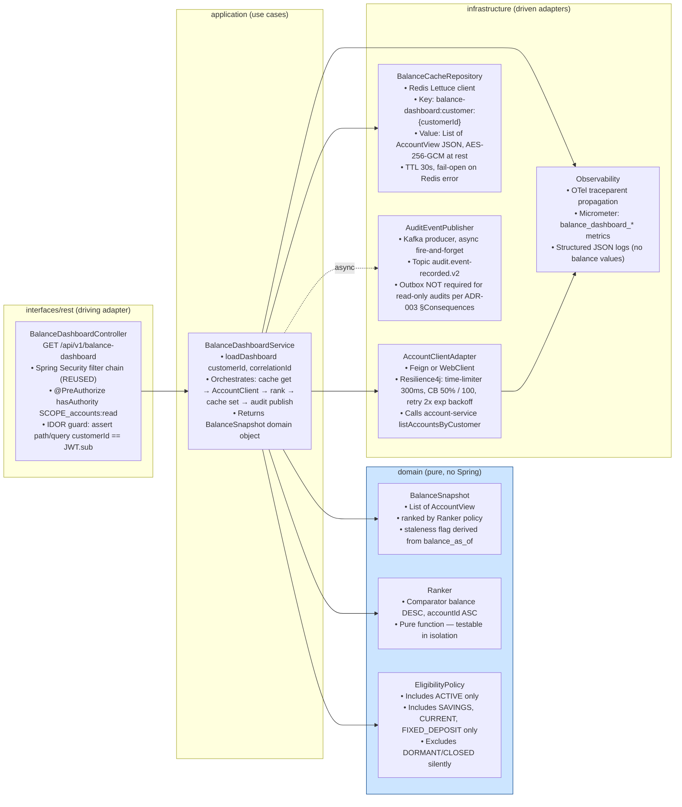
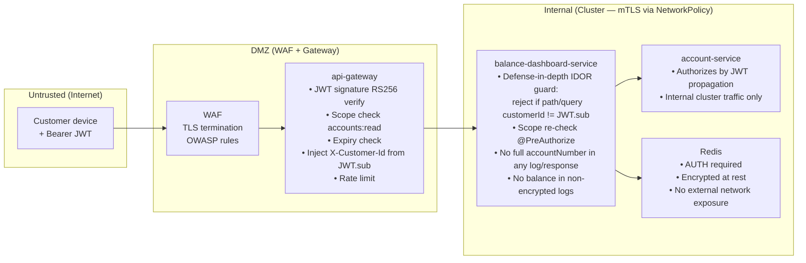

# System Architecture — Account Balance Comparison Dashboard

> **Feature slug:** `balance-comparison`
> **Artifact:** SA-001 (initial)
> **Sprint:** SPRINT-2026-Q2-BC-01
> **Source BA artifact:** `docs/ba/balance-comparison/handoff-ba-001.json`
> **Conventions:** `docs/architecture/overview.md`, `docs/architecture/project-structure.md`

---

## 1. Decision Summary (TL;DR)

| Concern | Decision | ADR |
|---|---|---|
| Service boundary | NEW `balance-dashboard-service` (read-only aggregator; CQRS read-side of Accounts) | [ADR-001](adrs/ADR-001-service-boundary.md) |
| Cache strategy | Redis TTL-only (30s); event-driven invalidation deferred to v1.1 | [ADR-002](adrs/ADR-002-cache-strategy.md) |
| Audit event schema | EXTEND existing `AuditEventRecorded` with optional `purpose`, `cacheHit`, `accountCount` fields (BACKWARD-compatible Avro evolution) | [ADR-003](adrs/ADR-003-audit-event-evolution.md) |
| Ranking responsibility | Server-side ranking in `balance-dashboard-service` (deterministic, cache-friendly) | [ADR-004](adrs/ADR-004-server-side-ranking.md) |
| `AccountClient.listAccountsByCustomer()` | **DOES NOT EXIST YET** — Tech Lead MUST add (SUBDEC-002). Specified in [`service-decomposition.md` §4](service-decomposition.md) | (no ADR — implementation contract) |
| FIXED_DEPOSIT balance composition | principal + accrued interest as of `balance_as_of` (SUBDEC-001 default confirmed) | Noted in ADR-001 §Consequences |

---

## 2. C4 Container Diagram (Mermaid)

The new `balance-dashboard-service` is a sibling of `account-service` in the `Accounts` bounded context. It is a **read-only aggregator** — owns NO RDBMS state. Its only persistent state is a per-customer Redis cache entry.

```mermaid
flowchart TB
    subgraph External["External"]
        Customer["Bank Customer<br/>Mobile Browser"]
    end

    subgraph Edge["Edge (existing — REUSED)"]
        WAF["WAF / CDN"]
        GW["api-gateway<br/>Spring Cloud Gateway<br/>• JWT RS256 validation<br/>• Rate limit 60 req/min/customer<br/>• X-Customer-Id from JWT sub<br/>• OTel traceparent injection"]
    end

    subgraph AccountsCtx["Accounts Bounded Context"]
        BDS["balance-dashboard-service<br/>NEW (Spring Boot 3.x, Java 21)<br/>• Hexagonal: domain · application · infrastructure<br/>• IDOR guard (defense-in-depth)<br/>• Server-side ranking (balance DESC, accountId ASC)<br/>• Redis cache-aside (TTL 30s, fail-open)<br/>• Resilience4j on AccountClient<br/>• Audit publisher (async, fire-and-forget)"]
        ACS["account-service<br/>EXISTING — REUSED<br/>• MUST add: listAccountsByCustomer(customerId)<br/>  batched endpoint (SUBDEC-002)<br/>• Returns AccountInfo[] with balance_as_of from ledger"]
    end

    subgraph IAM["IAM Bounded Context (existing — REUSED)"]
        IDS["identity-service<br/>OAuth2/OIDC<br/>JWKS endpoint"]
    end

    subgraph Compliance["Compliance Bounded Context (existing — EXTENDED)"]
        AUS["audit-service<br/>• Append-only<br/>• 7-year retention (BoT)<br/>• Consumes AuditEventRecorded v2<br/>  (extended with purpose, cacheHit, accountCount)"]
    end

    subgraph Infra["Shared Infrastructure (existing — REUSED)"]
        Redis["Redis 7<br/>shared cluster<br/>• Encrypted at rest (AES-256-GCM)<br/>• Key prefix: balance-dashboard:<br/>• TTL 30s per customer"]
        Kafka["Apache Kafka 3.x<br/>• Topic: audit.event-recorded.v2<br/>  (existing, schema extended)<br/>• Apicurio Avro registry"]
    end

    Customer -->|HTTPS TLS 1.2+| WAF
    WAF --> GW
    GW -->|JWKS public-key fetch| IDS
    GW -->|GET /api/v1/balance-dashboard<br/>X-Customer-Id| BDS

    BDS -->|GET balance-dashboard:customer:{id}| Redis
    BDS -->|listAccountsByCustomer cache MISS or fail-open<br/>Resilience4j: timeout 300ms, CB 50% / 100 calls| ACS
    BDS -->|SET balance-dashboard:customer:{id} TTL=30s<br/>encrypted payload| Redis
    BDS -.->|async publish AuditEventRecorded v2<br/>fire-and-forget| Kafka
    Kafka --> AUS

    ACS -->|balance_as_of from ledger| Ledger["ledger-service<br/>(transitive — not called directly by BDS)"]

    style BDS fill:#d4edda,stroke:#28a745,stroke-width:3px
    style ACS fill:#fff3cd,stroke:#ffc107,stroke-width:2px
    style AUS fill:#fff3cd,stroke:#ffc107,stroke-width:2px
```

**Legend:**
- 🟢 Green = NEW asset introduced by this feature
- 🟡 Yellow = EXISTING asset that requires extension (new method on `account-service`, new field on audit event schema)
- White = EXISTING asset reused as-is

---

## 3. Component View — Inside `balance-dashboard-service` (Hexagonal)



### 3.1 Package layout (target)

Following `docs/architecture/project-structure.md` hexagonal convention:

```
backend/balance-dashboard-service/
├── pom.xml
├── api/openapi.yaml                          # TL authors
├── src/main/java/com/bank/balancedashboard/
│   ├── BalanceDashboardServiceApplication.java
│   ├── domain/
│   │   ├── BalanceSnapshot.java
│   │   ├── AccountView.java                  # masked accountNumber, balance, balance_as_of, etc.
│   │   ├── Ranker.java
│   │   └── EligibilityPolicy.java
│   ├── application/
│   │   └── BalanceDashboardService.java      # use case orchestrator
│   ├── infrastructure/
│   │   ├── client/AccountClientAdapter.java  # delegates to AccountClient from common-libs
│   │   ├── cache/BalanceCacheRepository.java
│   │   ├── audit/AuditEventPublisher.java    # uses common-libs/audit-lib
│   │   └── config/
│   │       ├── ResilienceConfig.java
│   │       └── RedisConfig.java
│   └── interfaces/
│       └── rest/BalanceDashboardController.java
└── src/main/resources/
    ├── application.yml
    └── (NO db/migration/ — no RDBMS)
```

**No PostgreSQL database** — read-only aggregator. State lives in upstream (`account-service`) + cache (Redis). This is intentional and ratified by ADR-001.

---

## 4. Trust Boundaries & Security Layers



### 4.1 IDOR guard — defense in depth

Two checkpoints (both required):

1. **api-gateway:** Strips/ignores any client-supplied `customerId`; injects `X-Customer-Id` header from JWT `sub` claim.
2. **balance-dashboard-service:** If any request contains a `customerId` in path/query/body that does **not** match the JWT `sub`, the controller returns **HTTP 403** and emits an audit event with `result=FORBIDDEN` (AC-001-E2). This is intentional duplication — never trust the gateway alone for IDOR on PII-bearing endpoints.

---

## 5. Trace + Observability Path

OTel `traceparent` follows the request end-to-end:

```
Angular <balance-dashboard>  →  api-gateway  →  balance-dashboard-service  →  account-service  →  (ledger-service)
                                                          ↘  Redis (span: cache-get / cache-set)
                                                          ↘  Kafka (span: audit-publish, async)
```

- `correlationId` = OTel trace ID, propagated via HTTP headers and Kafka headers (per money-transfer convention; reuses `observability-lib`).
- Logs: structured JSON, every line carries `correlationId`, `customerId` (NEVER `accountNumber` or `balance`).
- Metrics (new, prefix `balance_dashboard_`):
  - `balance_dashboard_requests_total{status, cache_hit}`
  - `balance_dashboard_duration_ms{p50, p95, p99}`
  - `balance_dashboard_cache_hit_ratio` (derived)
  - `balance_dashboard_audit_events_total{result}`
  - `balance_dashboard_excluded_accounts_total{reason}` (status=DORMANT/CLOSED, type=LOAN/CREDIT, missing balance_as_of)
  - `balance_dashboard_cache_miss_reason_total{reason=TTL_EXPIRED|COLD_START|REDIS_UNAVAILABLE}`

---

## 6. Resilience Posture (Resilience4j defaults)

Applied to `AccountClient.listAccountsByCustomer()` call (the only synchronous external dependency in the read path):

| Pattern | Config | Rationale |
|---|---|---|
| Time limiter | `300ms` per call | Keeps cold-cache budget < 800ms with headroom for filter/rank/cache-set (~50ms each) and serialization |
| Circuit breaker | `slidingWindowSize=100`, `failureRateThreshold=50%`, `waitDurationInOpenState=30s` | Aligns with money-transfer convention; opens fast on account-service brownout |
| Retry | `maxAttempts=2`, `waitDuration=100ms` exponential, retry on `IOException`/`5xx` only (NOT on `4xx`) | Shorter chain than money-transfer (read-only, no money at risk) |
| Bulkhead | `maxConcurrentCalls=20` per pod | Prevents single pod from exhausting account-service connection pool during burst |
| Fallback | On CB-open or all retries exhausted → return cached snapshot if available with `staleness=DEGRADED` flag; else HTTP 503 with `Retry-After: 5` | NFR resilience: "show cached snapshot with may-be-stale indicator" |

**Redis is NOT wrapped in circuit breaker** — instead, **fail-open** is the policy (BR-015, NFR resilience). A Redis exception is logged, metric `cache_miss_reason=REDIS_UNAVAILABLE` is incremented, and the request proceeds as cache-miss to `AccountClient`. This is safer than CB because Redis is non-critical (cache, not source of truth).

---

## 7. Inputs / Outputs Contract (high-level — TL authors OpenAPI)

### Inbound endpoint

| Aspect | Value |
|---|---|
| Method + path | `GET /api/v1/balance-dashboard` |
| Auth | `Authorization: Bearer <JWT>` (scope `accounts:read`) |
| Request body | None |
| Query params | None (intentional — customerId comes from JWT, not from client; prevents IDOR by construction) |
| Response 200 | `{ accounts: [ { rank, accountId, maskedAccountNumber, accountType, balance, currency, balanceAsOf, isStale } ], cacheHit, correlationId }` |
| Response 401 | JWT missing/expired/invalid (no body details) |
| Response 403 | IDOR attempt (any client-supplied customerId mismatching JWT.sub); audit emitted with `result=FORBIDDEN` |
| Response 503 | AccountClient unavailable AND no cached snapshot to serve; includes `Retry-After: 5` header |
| Response headers | `X-Cache: HIT|MISS|STALE`, `X-Correlation-Id`, standard OTel `traceparent` echo |

### Outbound dependencies

| Dependency | Type | Contract |
|---|---|---|
| `account-service` | Sync HTTP | `GET /api/v1/accounts?customerId={id}` (the new batched endpoint TL must add — see [service-decomposition.md §4](service-decomposition.md)) |
| Redis (shared cluster) | Sync | `GET balance-dashboard:customer:{customerId}` / `SETEX balance-dashboard:customer:{customerId} 30 <json>` |
| Kafka topic `audit.event-recorded.v2` | Async fire-and-forget | Avro envelope; see [event-flows.md §3](event-flows.md) |

---

## 8. NFR-to-Mechanism Map (summary — full table in [`nfr-mapping.md`](nfr-mapping.md))

| NFR | Mechanism |
|---|---|
| p95 < 500ms warm | Redis cache hit serves from memory; no upstream calls; Java 21 virtual threads for Kafka publish (non-blocking) |
| p95 < 800ms cold | Single batched `AccountClient` call + Resilience4j 300ms time-limiter + parallel cache-set + async audit-publish |
| IDOR guard | Gateway injects `X-Customer-Id` from JWT.sub; service re-asserts; defense in depth |
| PDPA data minimization | DTO carries only masked `accountNumber`; Logback masking filter from `observability-lib`; no balance in non-encrypted logs |
| BoT audit (7yr retention) | Existing `audit-service` consumes extended `AuditEventRecorded v2`; retention inherited |
| Resilience | Resilience4j on `AccountClient`; fail-open on Redis; fallback to stale cache with degraded flag |
| Cache hit ratio > 70% | 30s TTL with 50 peak concurrent users → high reuse probability per customer session |

See [`nfr-mapping.md`](nfr-mapping.md) for the full NFR-by-NFR map.

---

## 9. What's Deferred (out of scope for SA-001)

- **Event-driven cache invalidation** on `AccountDebited` / `AccountCredited` — deferred to v1.1 (ADR-002). For v1, TTL-only suffices because read-staleness ≤ 30s is acceptable per BR-013.
- **FX gateway** for multi-currency aggregation (US-BC-004 deferred per OPEN-001).
- **mTLS sidecar mesh** between services — uses existing `NetworkPolicy` per money-transfer ADR-009.
- **Read-replica routing** — `account-service` already exposes its read API; no separate read replica needed at this scale.

---

## 10. Sub-Decisions Resolution Summary

| ID | Resolution | Where decided |
|---|---|---|
| SUBDEC-001 (FIXED_DEPOSIT balance) | **Confirm BA default: principal + accrued interest as of `balance_as_of`.** `balance-dashboard-service` is a pass-through aggregator and trusts `AccountInfo.balance` from `account-service`/`ledger-service`. If ledger returns principal-only, that becomes a `ledger-service` ADR — not ours. TL to verify in OpenAPI step. | ADR-001 §Consequences |
| SUBDEC-002 (batched `AccountClient` call) | **NEW METHOD REQUIRED.** Existing `AccountClient` only has `getAccountInfo(accountId)` (money-transfer S5 artifact). TL **must** add `listAccountsByCustomer(customerId): List<AccountInfo>` to the shared `account-client-lib` and a matching `account-service` endpoint. Specified in [service-decomposition.md §4](service-decomposition.md). | service-decomposition.md §4 |
| SUBDEC-003 (audit event schema) | **EXTEND, don't fork.** Add optional `purpose`, `cacheHit`, `accountCount` fields to existing `AuditEventRecorded` Avro schema. BACKWARD-compatible. Avoids audit-service code change. | ADR-003 |
| SUBDEC-004 (service boundary) | **NEW `balance-dashboard-service`.** Trade-offs documented in ADR-001. | ADR-001 |

---

## References

- [ADR-001 Service boundary](adrs/ADR-001-service-boundary.md)
- [ADR-002 Cache strategy](adrs/ADR-002-cache-strategy.md)
- [ADR-003 Audit event evolution](adrs/ADR-003-audit-event-evolution.md)
- [ADR-004 Server-side ranking](adrs/ADR-004-server-side-ranking.md)
- [Service decomposition](service-decomposition.md)
- [Event & cache flows](event-flows.md)
- [NFR mapping](nfr-mapping.md)
- BA artifacts: `docs/ba/balance-comparison/`
- PM risk register: `docs/pm/balance-comparison/risk-register.md`
- Prior money-transfer SA: `docs/artifacts/S3-solution-architect-money-transfer.json`
