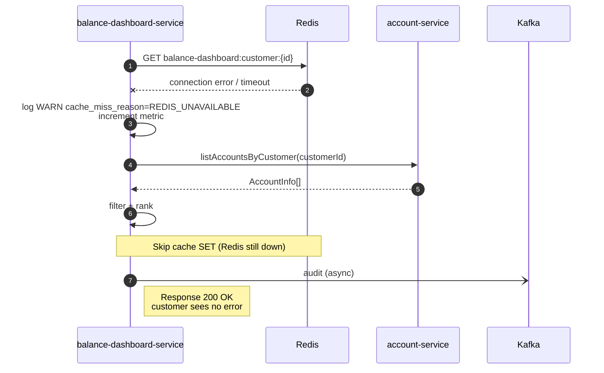
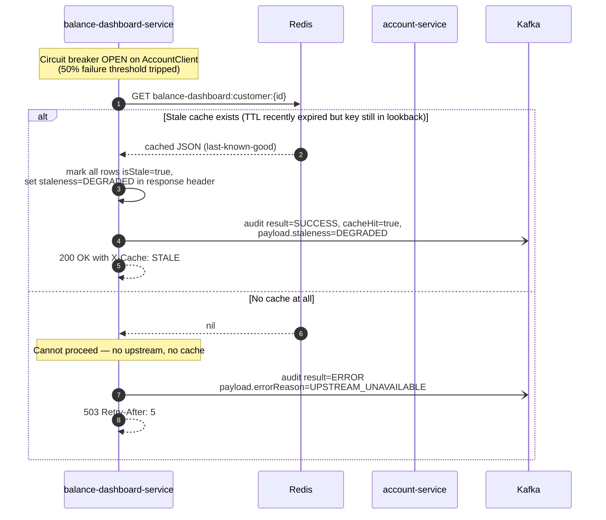
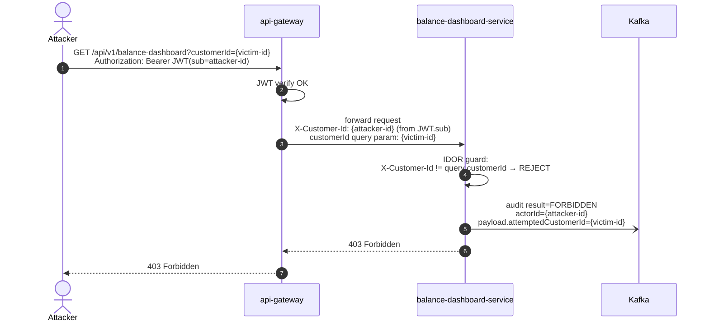

# Event Flows & Cache Strategy — Account Balance Comparison Dashboard

> **Feature slug:** `balance-comparison`
> **Artifact:** SA-001
> **Companion docs:** [architecture.md](architecture.md), [service-decomposition.md](service-decomposition.md), [ADR-002 cache strategy](adrs/ADR-002-cache-strategy.md), [ADR-003 audit event evolution](adrs/ADR-003-audit-event-evolution.md)

---

## 1. Overview

`balance-dashboard-service` is a **read-only aggregator**. The only event it emits is `AuditEventRecorded v2` (async fire-and-forget). It does NOT produce business-state events.

| Flow | Type | When |
|---|---|---|
| Cache HIT (warm) | Sync — Redis only | TTL window unexpired |
| Cache MISS (cold) | Sync — `AccountClient` + Redis SET | First request or post-TTL |
| Redis unavailable | Sync — `AccountClient` only (fail-open) | Redis cluster unreachable |
| AccountClient unavailable (warm fallback) | Sync — serve stale cache snapshot | CB open AND stale cache exists |
| AccountClient unavailable (no cache) | Sync — HTTP 503 | CB open AND no cache |
| Audit emit (every request) | Async — Kafka fire-and-forget | Always, regardless of outcome |

---

## 2. Cache Strategy Detail

### 2.1 Key, value, TTL

| Aspect | Value |
|---|---|
| **Key pattern** | `balance-dashboard:customer:{customerId}` |
| **Value format** | JSON array of `AccountView` objects (already filtered + ranked) |
| **TTL** | 30 seconds (BR-012) — set via `SETEX` |
| **Encryption** | AES-256-GCM at rest (cluster default) |
| **Serialization** | Jackson JSON; no full account number; balance as BigDecimal string to avoid float drift |

**Sample cached payload (one customer, 2 accounts):**
```json
[
  {"rank":1,"accountId":"a1...","maskedAccountNumber":"****1234","accountType":"SAVINGS","balance":"45000.00","currency":"THB","balanceAsOf":"2026-05-21T08:00:00Z"},
  {"rank":2,"accountId":"b2...","maskedAccountNumber":"****5678","accountType":"FIXED_DEPOSIT","balance":"12500.00","currency":"THB","balanceAsOf":"2026-05-20T09:30:00Z"}
]
```

> **Important:** the cache holds the **post-ranking** result. Ranking is server-side, deterministic ([ADR-004](adrs/ADR-004-server-side-ranking.md)), so cache hits skip both AccountClient and the ranker — saving CPU.

### 2.2 Invalidation policy (v1 = TTL-only)

- **No active invalidation.** The TTL alone bounds staleness to ≤ 30s.
- **BR-013 staleness threshold:** If `now() - balanceAsOf > 60s`, the response sets `isStale=true` per account row. This is independent of cache TTL — a fresh cache write can still carry an old `balanceAsOf` from ledger.
- **Cache write path:** Only on cache-miss after a successful `AccountClient` call. We never write the cache on error or partial data.
- **Cache eviction:** None beyond TTL. Redis `maxmemory-policy` is `allkeys-lru` at cluster level; if cache pressure becomes an issue we increase Redis memory or add a follow-up ADR — not a sprint-1 concern (50 peak × ~2KB = ~100KB, negligible).

### 2.3 Cache-miss reasons (observability)

Each cache miss is labeled with a reason for monitoring (metric `balance_dashboard_cache_miss_reason_total`):

| Reason | When | Severity |
|---|---|---|
| `COLD_START` | Service restart, key never written | INFO |
| `TTL_EXPIRED` | Normal expiry | INFO (most common) |
| `REDIS_UNAVAILABLE` | Connection error / timeout | WARN (alert if sustained > 1 minute) |

### 2.4 Future work (v1.1, NOT in this sprint — see ADR-002)

Consume `AccountDebited` / `AccountCredited` Kafka events; on receive, `DEL balance-dashboard:customer:{ownerCustomerId}`. Requires lookup of `customerId` from `accountId` (account-service or local mapping table). Deferred to v1.1 — not worth the complexity in a 10-day demo sprint.

---

## 3. Audit Event (the only emitted event)

### 3.1 Schema (Avro v2 — extended)

```
{
  "type": "record",
  "name": "AuditEventRecorded",
  "namespace": "com.bank.compliance.audit.v2",
  "fields": [
    {"name":"eventType",     "type":"string"},             // "BALANCE_INQUIRY"
    {"name":"actorId",       "type":"string"},             // customerId from JWT.sub (UUID)
    {"name":"channel",       "type":{"type":"enum","name":"Channel","symbols":["MOBILE_BANKING","WEB","API"]}},
    {"name":"correlationId", "type":"string"},             // OTel trace ID
    {"name":"timestamp",     "type":"long"},               // epoch-millis UTC
    {"name":"result",        "type":{"type":"enum","name":"Result","symbols":["SUCCESS","FAILURE","FORBIDDEN","ERROR"]}},
    {"name":"payload",       "type":["null",{"type":"map","values":"string"}], "default":null},
    {"name":"purpose",       "type":["null","string"],     "default":null},     // NEW v2 — "balance-inquiry"
    {"name":"cacheHit",      "type":["null","boolean"],    "default":null},     // NEW v2
    {"name":"accountCount",  "type":["null","int"],        "default":null}      // NEW v2
  ]
}
```

### 3.2 Event production rules

| Outcome | eventType | result | purpose | cacheHit | accountCount |
|---|---|---|---|---|---|
| Cache HIT, accounts returned | `BALANCE_INQUIRY` | `SUCCESS` | `balance-inquiry` | `true` | N |
| Cache MISS, accounts returned | `BALANCE_INQUIRY` | `SUCCESS` | `balance-inquiry` | `false` | N |
| Empty state (no eligible accounts) | `BALANCE_INQUIRY` | `SUCCESS` | `balance-inquiry` | `true|false` | `0` |
| IDOR attempt | `BALANCE_INQUIRY` | `FORBIDDEN` | `balance-inquiry` | `null` | `null` |
| AccountClient unavailable, no cache | `BALANCE_INQUIRY` | `ERROR` | `balance-inquiry` | `null` | `null` |
| Stale cache served (CB open, fallback) | `BALANCE_INQUIRY` | `SUCCESS` | `balance-inquiry` | `true` (with `payload.staleness="DEGRADED"`) | N |
| JWT invalid/expired | (NOT emitted — gateway rejects before BDS) | — | — | — | — |

**Why no audit on 401?** Per BA process-flow §"Alt Paths Summary", JWT invalid/expired is rejected at the gateway before reaching `balance-dashboard-service`. The gateway has its own auth-failure log stream. Adding a BDS-level audit on 401 would require gateway → BDS round-trip on every invalid request, which is wasteful. The gateway's existing audit covers this case.

### 3.3 Delivery semantics

| Property | Value | Why |
|---|---|---|
| Kafka topic | `audit.event-recorded.v2` | Versioned per project naming convention |
| Producer config | `acks=1` (leader-ack), `enable.idempotence=true` | Read-only audit doesn't justify `acks=all` overhead; idempotent producer prevents duplicate-on-retry within a session |
| Delivery guarantee | **At-least-once** | Standard for audit events |
| Consumer dedupe | Audit-service uses `(correlationId, eventType, timestamp)` natural key — already in money-transfer convention | Reuses existing |
| Send mode | **Fire-and-forget** (async, non-blocking on response path) | NFR: audit emit < 200ms overhead; customer-facing latency unaffected |
| **Outbox required?** | **No** | See §3.4 below |

### 3.4 Why no transactional outbox here?

The money-transfer service uses outbox because it has a business state (transfer row) that must atomically correlate with the event. Here, the "business state" of a read-only inquiry is... nothing. There's no row to write transactionally with the event.

The trade-off: in a Kafka-publish failure, we might lose one audit event. We accept this for v1 because:
1. BoT mandates "audit on every retrieval" — a single dropped event from a transient Kafka outage is recoverable from logs (correlationId in structured log + Kafka outage timestamp).
2. Adding outbox would require persisting per-request audit rows in `balance-dashboard-service` DB, which we explicitly don't have ([ADR-001](adrs/ADR-001-service-boundary.md)).
3. Async retry buffer (in-memory ring with bounded size + dead-letter to local disk) gives us pragmatic recovery — full design in TL implementation hop.

If compliance later mandates zero-loss audit on read paths, we add an `audit_outbox` table or a sidecar pattern in v1.1.

---

## 4. Sequence — Cache HIT (warm path, target p95 < 500ms)

```mermaid
sequenceDiagram
    autonumber
    actor Customer
    participant MobileUI as Angular &lt;balance-dashboard&gt;
    participant GW as api-gateway
    participant BDS as balance-dashboard-service
    participant R as Redis
    participant K as Kafka audit.event-recorded.v2

    Customer->>MobileUI: Open dashboard
    MobileUI->>GW: GET /api/v1/balance-dashboard<br/>Authorization: Bearer JWT<br/>traceparent: 00-...
    GW->>GW: Verify JWT (RS256, expiry, scope accounts:read)
    GW->>BDS: GET /api/v1/balance-dashboard<br/>X-Customer-Id: {sub}<br/>traceparent propagated

    BDS->>BDS: IDOR guard: assert no client-supplied customerId<br/>(query/path/body) conflicts with JWT.sub
    BDS->>R: GET balance-dashboard:customer:{customerId}
    R-->>BDS: cached JSON (ranked AccountView list)
    Note over BDS: cache HIT — no AccountClient call,<br/>no re-ranking, no filter

    BDS->>BDS: Compute isStale per row (now() - balanceAsOf > 60s)
    BDS-)K: async publish AuditEventRecorded v2<br/>eventType=BALANCE_INQUIRY<br/>result=SUCCESS, cacheHit=true,<br/>accountCount=N, purpose=balance-inquiry
    BDS-->>GW: 200 OK X-Cache: HIT
    GW-->>MobileUI: 200 OK
    MobileUI-->>Customer: render ranked list
```

**Latency budget (target < 500ms):**
- Gateway: ~20ms (JWT verify + routing)
- Redis GET: ~5ms
- IDOR guard + isStale compute: ~2ms
- Audit publish (async, off the critical path): 0ms on response path
- Serialization + network: ~50ms
- **Headroom: ~420ms** — comfortable

---

## 5. Sequence — Cache MISS (cold path, target p95 < 800ms)

```mermaid
sequenceDiagram
    autonumber
    actor Customer
    participant MobileUI as Angular &lt;balance-dashboard&gt;
    participant GW as api-gateway
    participant BDS as balance-dashboard-service
    participant R as Redis
    participant ACS as account-service
    participant Ledger as ledger-service
    participant K as Kafka audit.event-recorded.v2

    Customer->>MobileUI: Open dashboard
    MobileUI->>GW: GET /api/v1/balance-dashboard + JWT
    GW->>GW: JWT verify
    GW->>BDS: forward + X-Customer-Id
    BDS->>BDS: IDOR guard
    BDS->>R: GET balance-dashboard:customer:{customerId}
    R-->>BDS: nil (key absent or expired)

    BDS->>ACS: listAccountsByCustomer(customerId)<br/>Resilience4j: time-limit 300ms,<br/>retry 2x exp on 5xx
    ACS->>Ledger: query balance_as_of per account
    Ledger-->>ACS: ledger snapshot
    ACS-->>BDS: List of AccountInfo (all accounts, all statuses, all types)

    BDS->>BDS: EligibilityPolicy filter<br/>(ACTIVE + SAVINGS/CURRENT/FIXED_DEPOSIT only)<br/>emit excluded_accounts_total counter
    BDS->>BDS: Ranker sort: balance DESC, accountId ASC (tie-break)
    BDS->>BDS: Compute isStale per row

    par cache set (non-blocking on response)
        BDS->>R: SETEX balance-dashboard:customer:{customerId} 30 {json}
    and audit publish (async)
        BDS-)K: AuditEventRecorded v2<br/>result=SUCCESS, cacheHit=false, accountCount=N
    end

    BDS-->>GW: 200 OK X-Cache: MISS
    GW-->>MobileUI: 200 OK
    MobileUI-->>Customer: render ranked list
```

**Latency budget (target < 800ms):**
- Gateway: ~20ms
- Redis GET (miss): ~5ms
- AccountClient round trip (incl. account-service + ledger): ~300ms (time-limited)
- Filter + rank (10 accounts): ~5ms
- Redis SETEX (async — but in-process): ~10ms
- Audit publish (async, off critical path): 0ms
- Serialization + network: ~50ms
- **Total: ~390ms** — well within 800ms with retry headroom

---

## 6. Sequence — Redis unavailable (fail-open)



**Key property:** the customer-facing path returns 200 OK successfully. Redis is non-critical (cache). NO circuit breaker on Redis — every request retries Redis from scratch (cheap GET, fails fast). When Redis recovers, the next cache-miss writes a fresh entry.

---

## 7. Sequence — AccountClient unavailable with stale cache (degraded mode)



> **Implementation note for TL:** "Stale cache after TTL" requires a secondary key with longer TTL (e.g., `balance-dashboard:customer:{id}:lkg` with TTL 5 minutes, populated on every cache-miss success). Alternatively, defer this to v1.1 and just return 503 on CB-open; v1 only needs to cover the IN-TTL fallback case (CB opens while TTL is still valid). **For demo simplicity, recommend: v1 returns 503 immediately on AccountClient failure; v1.1 adds last-known-good cache.** This keeps the v1 demo path single-purpose.

---

## 8. Sequence — IDOR attempt



**Defense-in-depth note:** the cleanest design is for the endpoint to take **no** customerId parameter at all (always derived from JWT). The IDOR guard above protects against a future controller change accidentally accepting a query param — the audit log records the attempt regardless.

---

## 9. Event Catalog (final)

| Event | Producer | Consumer(s) | Topic | Schema ref | Delivery |
|---|---|---|---|---|---|
| `AuditEventRecorded v2` | `balance-dashboard-service` (new producer); `transfer-service` continues to emit v1 (backward-compatible) | `audit-service` | `audit.event-recorded.v2` | Apicurio subject `audit.event-recorded`, version 2 | at-least-once, fire-and-forget |

That's the **only** event this feature touches. No new business-state events — read-only feature.

---

## 10. Failure Mode Quick Reference

| Failure | Customer impact | Audit | Metric |
|---|---|---|---|
| JWT invalid | 401 from gateway | (gateway logs, not BDS audit) | `gateway_unauthorized_total` (existing) |
| IDOR attempt | 403 | `result=FORBIDDEN` | `balance_dashboard_requests_total{status=403}` |
| Redis down | 200 OK (transparent) | `result=SUCCESS, cacheHit=false` | `cache_miss_reason=REDIS_UNAVAILABLE` |
| AccountClient timeout (1st try) | retry (200 OK if 2nd succeeds) | `result=SUCCESS` | (no special metric — internal retry) |
| AccountClient all retries fail, no cache | 503 + Retry-After | `result=ERROR` | `balance_dashboard_requests_total{status=503}` |
| AccountClient CB open, stale cache (v1.1) | 200 OK + X-Cache: STALE | `result=SUCCESS, payload.staleness=DEGRADED` | `balance_dashboard_degraded_responses_total` |
| Kafka publish fails (audit lost) | 200 OK (customer sees nothing) | (event lost — recoverable from correlationId in structured log) | `balance_dashboard_audit_publish_failures_total` (alert if > 0.1%) |

---

## References

- [architecture.md](architecture.md)
- [service-decomposition.md](service-decomposition.md)
- [nfr-mapping.md](nfr-mapping.md)
- [ADR-002 Cache strategy](adrs/ADR-002-cache-strategy.md)
- [ADR-003 Audit event evolution](adrs/ADR-003-audit-event-evolution.md)
- BA process flow: `docs/ba/balance-comparison/process-flow.md`
