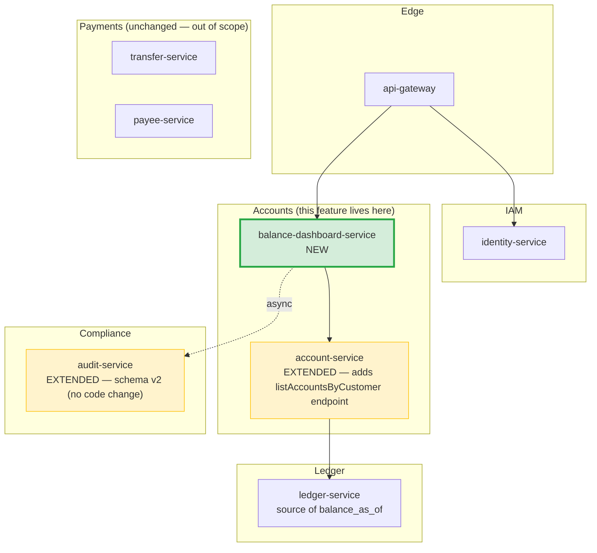

# Service Decomposition — Account Balance Comparison Dashboard

> **Feature slug:** `balance-comparison`
> **Artifact:** SA-001
> **Companion docs:** [architecture.md](architecture.md), [event-flows.md](event-flows.md), [nfr-mapping.md](nfr-mapping.md), [adrs/](adrs/)

---

## 1. NEW Assets

### 1.1 `balance-dashboard-service` (Spring Boot module, Java 21)

| Attribute | Value |
|---|---|
| **Bounded context** | Accounts (read-side; CQRS-style read projection of `account-service`) |
| **Responsibility** | Aggregate one customer's eligible accounts, rank them, cache the result, emit audit events. NO write operations. NO RDBMS state. |
| **Owns data** | None in RDBMS. Owns the Redis namespace `balance-dashboard:*` (cache-only, derived state). |
| **Consumes events** | None in v1. (v1.1 may consume `AccountDebited` / `AccountCredited` for event-driven invalidation per ADR-002 §Future Work.) |
| **Produces events** | `AuditEventRecorded v2` (envelope-extended, see [ADR-003](adrs/ADR-003-audit-event-evolution.md)) on every dashboard load — async fire-and-forget |
| **HTTP endpoint** | `GET /api/v1/balance-dashboard` (TL authors OpenAPI) |
| **Scope required** | `accounts:read` (or equivalent — TL to confirm existing scope name) |
| **Deployment** | Same Kubernetes namespace as `account-service`; min 2 replicas; HPA on CPU + request rate; Helm chart per `project-structure.md` |
| **Database** | NONE. No Flyway migrations. (TL: do NOT scaffold `db/migration/`.) |
| **Feature flag** | `balance-dashboard.enabled` defaults `false` in non-staging |

**Why a separate service?** See [ADR-001](adrs/ADR-001-service-boundary.md). Short version:
- Different scaling profile (read-heavy aggregation vs. write-heavy account CRUD).
- Cache layer is feature-specific and would bloat `account-service` if embedded.
- Independent deploy unblocks demo-day rollback without risking transfer flow.
- Conway's Law: balance-dashboard is a new bounded responsibility for the Accounts team; deserves its own deployable.

### 1.2 Redis namespace + cache entry

| Attribute | Value |
|---|---|
| **Key pattern** | `balance-dashboard:customer:{customerId}` |
| **Value** | JSON: `[{"accountId":"...","maskedAccountNumber":"****1234","accountType":"SAVINGS","balance":45000.00,"currency":"THB","balanceAsOf":"2026-05-21T08:00:00Z"}, ...]` |
| **TTL** | 30 seconds (BR-012) |
| **Encryption at rest** | AES-256-GCM (cluster default — consistent with money-transfer convention) |
| **Eviction policy** | None beyond TTL; we never explicitly DEL in v1 |
| **Connection pool** | Lettuce; size 16 per pod (50 peak concurrent ÷ ~3 pods, with headroom) |

> **BR-007 reminder:** the cached payload MUST already contain the masked accountNumber. The cache itself never holds full PANs.

### 1.3 New endpoint contract (conceptual — TL authors OpenAPI)

```
GET /api/v1/balance-dashboard
Authorization: Bearer <JWT>

200 OK
{
  "cacheHit": true,
  "correlationId": "...",
  "accounts": [
    {
      "rank": 1,
      "accountId": "uuid",
      "maskedAccountNumber": "****1234",
      "accountType": "SAVINGS",
      "balance": 45000.00,
      "currency": "THB",
      "balanceAsOf": "2026-05-21T08:00:00Z",
      "isStale": false
    }
  ]
}

401 — missing/invalid JWT (no body)
403 — IDOR attempt; audit emitted with result=FORBIDDEN
503 — AccountClient unavailable AND no cached snapshot; Retry-After: 5
```

### 1.4 New Grafana dashboard (DevOps P2 to create)

Panels: request rate, error rate, p95 latency, cache hit ratio, audit-event rate, excluded-accounts counter, cache miss reason breakdown.

---

## 2. REUSED Assets (MUST NOT rebuild)

| Asset | Source | How balance-dashboard-service uses it |
|---|---|---|
| `AccountClient` (Feign/WebClient interface in `common-libs/account-client-lib`) | money-transfer (S3 + S5 artifacts) | Calls `listAccountsByCustomer(customerId)` (NEW METHOD — see §4 below). Existing `getAccountInfo(accountId)` is NOT used by this feature. |
| `AccountInfo` DTO | money-transfer `S2-ba-money-transfer.json` entity `Account` | Used as-is for the data model. Fields: `accountId`, masked `accountNumber`, `accountType`, `balance`, `currency`, `status`, `balance_as_of`. **DO NOT REDEFINE.** |
| OAuth2/OIDC + JWT auth filter chain | `identity-service` + `api-gateway` (existing) | Reused unchanged. JWT scope `accounts:read` required. JWT `sub` becomes `X-Customer-Id` injected by gateway. |
| `audit-service` event emitter library (`common-libs/audit-lib`) | money-transfer (S3 ADR-012) | Reused for async fire-and-forget publish to Kafka topic `audit.event-recorded.v2`. |
| OpenTelemetry tracing setup (`common-libs/observability-lib`) | money-transfer S3 tech_choices | Reused for trace propagation through Angular → Gateway → BDS → AccountClient → audit topic. Logback JSON masking filter (`accountNumber`, `balance`) reused. |
| Resilience4j configuration patterns | money-transfer S3 ADR-009 + S5 implementation | Reused with adjusted thresholds: time-limiter 300ms (vs money-transfer 800ms), retry 2x exp (vs 1x), CB 50%/100 calls. |
| Redis cluster (shared infra) | Money-transfer ADR-009 / ASSUME-004 (PM risk register) | Reused; new key prefix `balance-dashboard:` reserved. |
| Apicurio schema registry | Money-transfer ADR-010 | Reused. Schema evolution per ADR-003 (BACKWARD compatibility). |
| `api-gateway` route configuration | existing | Add route `/api/v1/balance-dashboard/**` → `balance-dashboard-service` (DevOps P2 task). |
| Logback masking filter (account number + balance redaction) | money-transfer `observability-lib` | Reused as-is. |

---

## 3. EXTENDED Assets

### 3.1 `AuditEventRecorded` Avro schema → v2 (BACKWARD-compatible)

This is the schema change. Detailed rationale in [ADR-003](adrs/ADR-003-audit-event-evolution.md). Shape:

**v1 (existing, money-transfer):**
```
{
  eventType:    string,       // e.g. TRANSFER_REQUESTED
  actorId:      string (UUID),
  channel:      enum,
  correlationId: string,
  timestamp:    long (epoch-millis),
  result:       enum (SUCCESS | FAILURE | FORBIDDEN | ERROR),
  payload:      union { null, map<string, string> }   // free-form per eventType
}
```

**v2 (extended — adds 3 OPTIONAL fields with null defaults):**
```
{
  eventType:     string,        // BALANCE_INQUIRY (NEW), TRANSFER_REQUESTED (existing), ...
  actorId:       string (UUID),
  channel:       enum,
  correlationId: string,
  timestamp:     long,
  result:        enum,
  payload:       union { null, map<string, string> },
  purpose:       union { null, string }    // NEW — default null; e.g. "balance-inquiry"
  cacheHit:      union { null, boolean }   // NEW — default null; true on cache HIT, false on MISS
  accountCount:  union { null, int }       // NEW — default null; count of accounts returned (0 for empty state)
}
```

| Property | Value |
|---|---|
| Schema compatibility | **BACKWARD** (existing money-transfer producers continue to publish v1; audit-service consumer reads v2 with null defaults for old records) |
| Apicurio registration | `audit.event-recorded` subject, version 2 (Apicurio compatibility check: BACKWARD) |
| Topic | `audit.event-recorded.v2` (versioned per `project-structure.md` naming convention — see ADR-003 for topic-versioning rationale) |
| Consumer change required | NONE in audit-service code (audit-service treats `payload` + the 3 new fields as opaque columns/JSON). DevOps adds Avro v2 schema to Apicurio. |

### 3.2 `audit-service` (no code change, schema-only extension)

- **No code change required** in `audit-service`. It already stores audit events as immutable rows; the 3 new fields land as additional columns or JSON keys. DevOps confirms during P1 schema migration.
- **Retention inherited** (7-year per BoT).

---

## 4. SUBDEC-002 Resolution — New Method on `AccountClient`

**Problem:** US-BC-003 BR-016 requires a single batched call. Money-transfer's `AccountClient` only exposes `getAccountInfo(accountId)` (per `docs/artifacts/S5-backend-dev-money-transfer.json`). A loop of N single calls would breach p95 < 800ms cold-cache for N=10 (would require ~10×300ms = 3000ms in serial, or fragile parallel fan-out).

**Decision:** TL **must add** the following batched method to `common-libs/account-client-lib`:

```java
public interface AccountClient {

    // Existing — used by money-transfer
    AccountInfo getAccountInfo(UUID accountId);

    // NEW — required by balance-dashboard-service
    /**
     * Returns all accounts owned by the given customer.
     * Server-side filtering by status / accountType is the responsibility of the caller
     * (balance-dashboard-service applies EligibilityPolicy on the response).
     *
     * @param customerId from JWT sub
     * @return list of AccountInfo; may be empty; never null
     * @throws AccountServiceUnavailableException on upstream 5xx or timeout (after Resilience4j retries)
     */
    List<AccountInfo> listAccountsByCustomer(UUID customerId);
}
```

**Matching `account-service` endpoint TL must add:**
```
GET /api/v1/accounts?customerId={uuid}
Authorization: Bearer <JWT>  (scope accounts:read)

200 OK
[ AccountInfo, AccountInfo, ... ]
```

**Filter policy:** `account-service` returns **all** accounts owned by the customer (regardless of status/type). `balance-dashboard-service` applies `EligibilityPolicy` (ACTIVE + SAVINGS/CURRENT/FIXED_DEPOSIT) locally. Reason: keep `account-service` business-rule-free; let the consuming service decide eligibility. This also lets future consumers reuse the same endpoint with different filters.

**Resilience4j defaults** (for the new method, configured in `balance-dashboard-service`):
- Time limiter: **300ms** per call
- Retry: **2 attempts**, exponential backoff (100ms, 200ms), on 5xx/IOException only
- Circuit breaker: sliding window 100, failure threshold 50%, open duration 30s
- Bulkhead: max concurrent 20 per pod
- Fallback: serve last-known-good cached snapshot if available (with `isStale=true`); else HTTP 503

---

## 5. Bounded Context Diagram



---

## 6. Data Ownership Audit (no shared-DB anti-pattern)

| Service | Owns (RDBMS) | Reads via API | Reads via Event | Cache (Redis) |
|---|---|---|---|---|
| `balance-dashboard-service` (NEW) | **NONE** | `account-service` (`listAccountsByCustomer`) | — | `balance-dashboard:customer:{id}` (namespace owned) |
| `account-service` (existing) | `accounts`, `account_holds`, etc. | — | (existing, unchanged) | (existing, unchanged) |
| `audit-service` (existing) | `audit_log` (append-only) | — | All `AuditEventRecorded v2` | — |

**Verification:** `balance-dashboard-service` does **not** access any other service's database. All cross-service data flows through `AccountClient` (sync HTTP) or Kafka (async). ✅ No bounded-context violation.

---

## 7. Build & Deployment Topology

- **Maven module:** `backend/balance-dashboard-service/` added to parent POM (alongside `account-service`, `transfer-service`, etc.).
- **Container image:** `bank/balance-dashboard-service:<semver>` (per `project-structure.md` naming).
- **Helm chart:** `infra/helm/balance-dashboard-service/` — DevOps P1 scaffolds.
- **Min replicas:** 2 across 2 AZs (lower tier than transfer-service since read-only).
- **HPA:** CPU 70% + `balance_dashboard_requests_total` rate > 30/s/pod.
- **NetworkPolicy:** ingress allowed only from `api-gateway`; egress to `account-service`, Redis, Kafka.

---

## 8. Risks Surfaced for Tech Lead

| Risk | Mitigation in TL hop |
|---|---|
| `AccountInfo.balance` semantics for FIXED_DEPOSIT may be principal-only (SUBDEC-001) | TL inspects `account-service` ledger query during OpenAPI authoring; if principal-only, raises to PM and BA decides whether to add `accruedInterest` field or accept principal-only display for v1 |
| N=10 single calls would breach p95 | TL **must** add batched endpoint per §4 above; integration test in QA P2 verifies single round-trip |
| Cache size growth | At 50 peak concurrent customers × ~2KB per entry = ~100KB; negligible. No eviction strategy needed beyond TTL. |
| Avro schema evolution coordination | DevOps registers v2 schema in Apicurio BEFORE balance-dashboard-service deploys; documented in [ADR-003 §Implementation Sequencing](adrs/ADR-003-audit-event-evolution.md) |

---

## References

- [architecture.md](architecture.md)
- [event-flows.md](event-flows.md)
- [nfr-mapping.md](nfr-mapping.md)
- [ADR-001 service boundary](adrs/ADR-001-service-boundary.md)
- [ADR-002 cache strategy](adrs/ADR-002-cache-strategy.md)
- [ADR-003 audit event evolution](adrs/ADR-003-audit-event-evolution.md)
- [ADR-004 server-side ranking](adrs/ADR-004-server-side-ranking.md)
- Money-transfer SA: `docs/artifacts/S3-solution-architect-money-transfer.json`
- Money-transfer backend dev: `docs/artifacts/S5-backend-dev-money-transfer.json` (confirms `AccountClient` only has `getAccountInfo` today)
